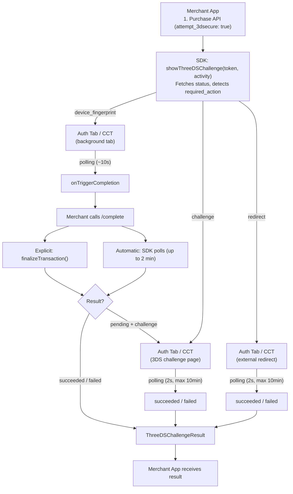

# Gateway-Specific 3DS Integration

Gateway-Specific 3DS handles authentication through the payment gateway itself rather than a unified provider like Forter. Use this flow when your gateway explicitly requires gateway-managed 3DS handling and the purchase response includes a `required_action` field.

For most integrations, use [Global 3DS](3ds-global.md) instead. Only use this flow when your gateway requires it.

**Dependencies:** Both `checkout-payments-core` and `checkout-threeds` are required. See [Getting Started](getting-started.md) for setup.

---

## Quick Start

### 1. Initialize the SDK

```kotlin
class PaymentViewModel(
    private val context: Context,
    private val activity: Activity
) : ViewModel() {
    val sdk = Spreedly()

    init {
        viewModelScope.launch {
            val authParams = yourBackendApi.getAuthParams()

            val options = SpreedlySDKInitOptions(
                nonce = authParams.nonce,
                signature = authParams.signature,
                certificateToken = authParams.certificateToken,
                timestamp = authParams.timestamp.toString(),
                environmentKey = "your_environment_key",
                context = context.applicationContext,
            )
            sdk.init(options)
        }

        setupSubscriptions()
    }
}
```

### 2. Subscribe to Events

Subscribe in your ViewModel's `init` block **before** calling `showThreeDSChallenge()`:

```kotlin
import com.spreedly.threeds.gatewayspecific.GatewaySpecific3DSIntegration
import com.spreedly.sdk.ui.ThreeDSChallengeResult

private fun setupSubscriptions() {
    viewModelScope.launch {
        sdk.gatewaySpecific3DSTriggerCompletionFlow.collect { event ->
            val response = backendApi.completeTransaction(event.token)

            response.transaction?.let { transaction ->
                GatewaySpecific3DSIntegration.finalizeTransaction(
                    transactionToken = event.token,
                    transactionStatus = transaction
                )
            }
        }
    }

    viewModelScope.launch {
        sdk.threeDSChallengeResultFlow.collect { result ->
            when (result) {
                is ThreeDSChallengeResult.Success -> {
                    sdk.hideThreeDSChallenge()
                    showSuccess("Payment completed!")
                }
                is ThreeDSChallengeResult.Failed -> {
                    sdk.hideThreeDSChallenge()
                    showError(result.message ?: "3DS challenge failed")
                }
                is ThreeDSChallengeResult.Canceled -> {
                    sdk.hideThreeDSChallenge()
                    showError("Payment canceled")
                }
                is ThreeDSChallengeResult.Initial -> Unit
            }
        }
    }
}
```

### 3. Initiate Payment

Call your purchase API with `attempt_3dsecure = true`, then start the 3DS flow:

```kotlin
fun pay(paymentMethodToken: String, amount: Int) {
    viewModelScope.launch {
        val response = backendApi.purchase(
            paymentMethodToken = paymentMethodToken,
            amount = amount,
            currencyCode = "USD",
            attempt3dsecure = true
        )

        val transaction = response.transaction ?: return@launch

        if (transaction.requiredAction != null) {
            sdk.showThreeDSChallenge(transaction.token, activity)
        } else {
            showSuccess("Payment completed!")
        }
    }
}
```

### 4. Add the UI Component

```kotlin
@Composable
fun PaymentScreen(viewModel: PaymentViewModel) {
    Scaffold { padding ->
        Column(modifier = Modifier.padding(padding)) {
            PayButton(onClick = { viewModel.pay() })
        }

        ThreeDSChallengeSheet(sdk = viewModel.sdk)
    }
}
```

`ThreeDSChallengeSheet` handles both Global and Gateway-Specific flows automatically.

### Test Amounts

| Amount | Scenario |
|--------|----------|
| $30.03 | Device fingerprint only (no challenge) |
| $30.04 | Device fingerprint + challenge (retained card) |
| $30.05 | Direct challenge (no fingerprint) |

---

## How It Works

### Auth Tab

The SDK uses Auth Tab for all 3DS browser flows on Chrome 137+. Auth Tab provides a stripped-down browser UI with no address bar, bookmarks, or "Open in Chrome" — preventing users from navigating away during authentication. On Chrome < 137 or non-Chrome browsers, the SDK falls back to a standard Chrome Custom Tab automatically.

### Completion Approaches

After device fingerprinting completes, the SDK emits `gatewaySpecific3DSTriggerCompletionFlow`. At that point the merchant must call their backend `/complete` endpoint. Two approaches exist for handling the response:

**Explicit finalization (recommended)** — Pass the `/complete` response to `GatewaySpecific3DSIntegration.finalizeTransaction()`. The SDK processes it immediately without additional status polling.

**Automatic polling (default)** — Skip `finalizeTransaction()`. The SDK polls `checkTransactionStatus()` every 2 seconds for up to 2 minutes. Also acts as a fallback if explicit finalization fails.

### Flow Diagram



---

## Purchase API Requirements

Gateway-Specific 3DS requires `attempt_3dsecure: true` in the purchase request. Use a flat JSON structure — parameters at root level, not nested in a `"transaction"` object.

```json
{
    "amount": 3005,
    "currency_code": "USD",
    "payment_method_token": "PMToken123",
    "attempt_3dsecure": true
}
```

Configure JSON serialization with `explicitNulls = false` and `encodeDefaults = true`.

### Response Format

The response includes a `required_action` field:

| `required_action` value | Meaning |
|------------------------|---------|
| `"device_fingerprint"` | Device fingerprinting required |
| `"challenge"` | Direct 3DS challenge required |
| `"redirect"` | Redirect to external page |
| `null` | No 3DS required |

### Backend /complete Endpoint

Your backend must expose a `/complete` endpoint that proxies to Spreedly Core:

```
POST https://core.spreedly.com/v1/transactions/{token}/complete.json
Headers:
    Authorization: Bearer {access_secret}
    Content-Type: application/json
```

---

## Device Fingerprint

When `required_action` is `"device_fingerprint"`, the SDK:

1. Opens the `device_fingerprint_form_embed_url` in an Auth Tab (or Chrome Custom Tab fallback)
2. Polls the transaction status about once per second for up to **10 seconds**
3. Emits `gatewaySpecific3DSTriggerCompletionFlow` when fingerprinting is complete

Fingerprint completion is detected through **status polling**, not through a custom WebView or JavaScript bridge in your app.

### Braintree

When the purchase status has `gateway_type` **braintree** and `required_action` **device_fingerprint**, the SDK opens the **challenge** step directly instead of the fingerprint tab. Your purchase response must include a `challenge_url` or `challenge_form_embed_url`. If neither is present, the flow ends with **Challenge URL missing**.

### Worldpay and other gateways

For gateways such as Worldpay, the fingerprint tab runs as described above. Allow up to **10 seconds** for the SDK to detect completion and emit `gatewaySpecific3DSTriggerCompletionFlow` before you call your backend `/complete` endpoint.

After fingerprinting, call your backend `/complete` endpoint. The response determines the next step:

- **`succeeded` or `failed`** — SDK emits a final result via `threeDSChallengeResultFlow`
- **`pending` with `required_action = "challenge"`** — SDK launches the challenge

---

## Challenge Handling

Challenges are displayed in an Auth Tab (or CCT fallback). The SDK launches the tab automatically — no manual view embedding is needed.

Once launched, the SDK emits `gatewaySpecific3DSChallengeReadyFlow` and polls every **2 seconds** until the transaction reaches a terminal state or **10 minutes** elapse.

When `required_action` is `"challenge"` from the initial purchase (e.g., $30.05 test amount), the SDK skips device fingerprinting and launches the challenge directly.

If challenge or redirect polling runs for **10 minutes** without a terminal status, the SDK reports a challenge timeout failure.

### App backgrounding

If the user backgrounds your app during fingerprinting, challenge, or the post-fingerprint wait, status polling generally continues. When they return, the SDK presents results through the same flows.

---

## API Reference

### Methods

| Method | Purpose |
|--------|---------|
| `sdk.showThreeDSChallenge(token, activity)` | Start 3DS flow — `suspend`, call inside `viewModelScope.launch` |
| `GatewaySpecific3DSIntegration.finalizeTransaction(token, status)` | Finalize with `/complete` response |
| `GatewaySpecific3DSIntegration.cleanupLifecycle(token)` | Manual cleanup (optional — SDK cleans up automatically on success/failure) |

`GatewaySpecific3DSIntegration` is in package `com.spreedly.threeds.gatewayspecific`.

### Event Flows

| Flow | Type | When |
|------|------|------|
| `sdk.gatewaySpecific3DSTriggerCompletionFlow` | `GatewaySpecific3DSEvent` | Device fingerprint done — merchant must call `/complete` |
| `sdk.gatewaySpecific3DSChallengeReadyFlow` | `GatewaySpecific3DSEvent` | Challenge launched in Auth Tab / CCT |
| `sdk.threeDSChallengeResultFlow` | `ThreeDSChallengeResult` | Final result (success/failure/canceled) |

### Transaction States

**Terminal states** (polling stops, final result emitted):

| State | Classification |
|-------|---------------|
| `succeeded` | Success |
| `complete` | Success |
| `failed` | Failed |
| `gateway_processing_failed` | Failed — gateway declined |
| `gateway_processing_result_unknown` | Failed — verify server-side before treating as definitive |
| `gateway_setup_failed` | Failed — offsite gateway setup failed |

**Non-terminal states** (polling continues):

| State | Description |
|-------|-------------|
| `pending` | Awaiting further processing |
| `processing` | Accepted but funds not yet received |

### Manifest Permission

The SDK declares the `REORDER_TASKS` permission in its manifest (auto-merged). This normal permission brings the host activity to the foreground when a 3DS browser tab completes. No runtime prompt required.

---

## Troubleshooting

### Challenge Not Launching

- Flow collectors not set up in `init {}` before calling `showThreeDSChallenge()`
- Activity reference not passed to `showThreeDSChallenge()`
- No Chrome-compatible browser installed on the device

### Transaction Succeeds Without 3DS

- Not using a test amount that triggers 3DS (use 3003, 3004, or 3005 cents)
- Missing `attempt_3dsecure: true` in the purchase request
- Nested JSON structure `{ "transaction": { ... } }` instead of flat

### Completion Polling Timeout

**Symptom:** Error after 2 minutes — "Timeout waiting for /complete.json API call"

Verify your backend processes the `/complete` call, that `gatewaySpecific3DSTriggerCompletionFlow` is subscribed, and that you call `finalizeTransaction()` with the `/complete` response when possible.

### Challenge URL Missing (Braintree)

**Symptom:** Flow fails immediately with **Challenge URL missing** after a Braintree purchase returns `device_fingerprint`.

Ensure the purchase status includes `challenge_url` or `challenge_form_embed_url`. The SDK opens the challenge step directly for Braintree and does not run the fingerprint tab when those URLs are required for the next step.

### Challenge Polling Timeout

**Symptom:** Error after **10 minutes** of challenge or redirect polling.

The user may need to complete authentication in the browser tab, or the transaction may be stuck on the gateway. Check transaction status on your backend and retry or cancel the payment as your product requires.

### Complete API Returns 404

The SDK waits ~10 seconds for device fingerprinting before triggering the completion callback. Verify your backend endpoint proxies to `POST /v1/transactions/{token}/complete.json` on Spreedly Core.

### JSON Parsing Errors

**Symptom:** `JsonConvertException` when parsing responses

Use flat JSON structure and configure serialization with `explicitNulls = false` and `encodeDefaults = true`.

### Known Issues

**Chrome Custom Tab to browser redirect (CCT fallback only)** — On Chrome < 137 or non-Chrome browsers, the SDK falls back to Chrome Custom Tabs. In this path, a user can navigate from the Custom Tab to the full Chrome browser during a 3DS challenge, preventing automatic redirect back to the app. On Chrome 137+, Auth Tab eliminates this issue entirely.

---

## See Also

- [Global 3DS](3ds-global.md)
- [Error Handling](error-handling.md)
- [Getting Started](getting-started.md)
- [Sample App ViewModel](../../app/src/main/java/com/spreedly/example/screens/threedschallenge/ThreeDSExampleViewModel.kt)
- [Sample App UI](../../app/src/main/java/com/spreedly/example/screens/threedschallenge/ThreeDSExampleScreen.kt)
