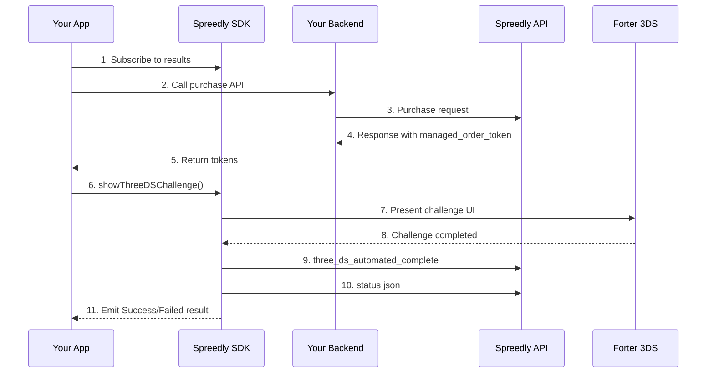

# Global 3DS Integration (Forter)

A practical guide for integrating Global 3DS authentication (Forter-based) into your Android app using the Spreedly SDK.

> **Unified 3DS Component** — The SDK provides `ThreeDSChallengeSheet` that works for both Global
> and Gateway-Specific 3DS flows, matching the iOS SDK's approach.

---

## Table of Contents

- [Introduction](#introduction)
- [Global vs Gateway-Specific 3DS](#global-vs-gateway-specific-3ds)
- [Prerequisites](#prerequisites)
- [Project Setup](#project-setup)
- [SDK Initialization](#sdk-initialization)
- [Implementing the 3DS Flow](#implementing-the-3ds-flow)
- [UI Integration](#ui-integration)
- [Testing Your Integration](#testing-your-integration)
- [Backend Requirements](#backend-requirements)
- [Troubleshooting](#troubleshooting)
- [API Reference](#api-reference)

---

## Introduction

### What is Global 3DS?

Global 3DS uses the Forter 3DS SDK to handle authentication challenges across multiple payment
gateways. Forter's 3DS authentication is **backend-driven**: the mobile SDK collects device
fingerprinting data, your backend submits transaction details to Spreedly (which coordinates with
Forter), and the SDK presents a challenge UI when required.

### When to Use Global 3DS

Use Global 3DS when:
- You want a consistent 3DS experience across multiple gateways
- You're using Forter for fraud prevention
- Your gateway doesn't require gateway-specific 3DS handling
- You want the SDK to fully manage the authentication flow

---

## Global vs Gateway-Specific 3DS

The Spreedly SDK supports two types of 3DS flows:

| Feature                    | Global 3DS (This Guide)                   | Gateway-Specific 3DS                              |
|----------------------------|-------------------------------------------|---------------------------------------------------|
| **Provider**               | Forter SDK                                | Gateway's own 3DS implementation                  |
| **Use Case**               | Multi-gateway support, unified experience | Gateway requires specific 3DS flow                |
| **Purchase API Parameter** | `attempt_3dsecure` **NOT included**       | `attempt_3dsecure: true` **required**             |
| **SDK Integration**        | `sdk.showThreeDSChallenge(token)`         | `sdk.showThreeDSChallenge(token, activity)`       |
| **Challenge UI**           | Automatic bottom sheet                    | Auth Tab / CCT (SDK-managed)                      |
| **Backend Calls**          | SDK handles automatically                 | Merchant calls `/complete.json`                   |
| **Complexity**             | Simple                                    | More complex (merchant-driven)                    |
| **Response Field**         | `sca_authentication` present              | `required_action` field present                   |

### How to Choose?

- **Use Global 3DS** (this guide) if your gateway works with Forter or you're unsure
- **Use Gateway-Specific 3DS** only if your payment gateway explicitly requires it

For Gateway-Specific 3DS integration, see [Gateway-Specific 3DS](3ds-gateway-specific.md).

---

## Benefits of SDK-Managed 3DS

The Spreedly SDK provides a complete, secure implementation of 3DS authentication:

✅ **Fully Automated** — SDK handles the entire 3DS challenge flow
✅ **PCI Compliant** — Secure handling of sensitive authentication data
✅ **Simple Integration** — Just a few lines of code to enable
✅ **Customizable UI** — Pre-built bottom sheet that matches your app's theme
✅ **Backend Integration** — SDK automatically handles API calls after challenge completion

### What the SDK Handles Automatically

When you integrate Global 3DS, the following is handled for you:

1. **Forter SDK Lifecycle** — Initialization, activity lifecycle callbacks, and device fingerprinting
2. **Challenge Presentation** — Displays authentication UI in a bottom sheet
3. **Backend API Calls** — Automatically calls `three_ds_automated_complete` and `status.json` APIs
4. **Transaction Status Checking** — Polls for final transaction state
5. **Result Mapping** — Converts complex responses into simple Success/Failed/Canceled states
6. **Error Handling** — Graceful handling of network errors and edge cases

### How Forter 3DS Works Under the Hood

The mobile SDK's role in the Forter 3DS flow is focused on device data and challenge presentation:

1. **Device Fingerprinting** — Forter SDK automatically collects device data in the background
2. **Backend Coordination** — Your backend submits transaction details to Spreedly, which coordinates with Forter for a fraud decision
3. **Challenge Trigger** — If Forter requires a challenge, the Spreedly API response includes `sca_authentication`
4. **Challenge Presentation** — The SDK presents the challenge UI and collects the user's response
5. **Completion** — The SDK calls `three_ds_automated_complete` and checks transaction status; your backend then calls `complete_gratis` to finalize

---

## Prerequisites

Before integrating 3DS authentication, ensure you have:

### Minimum Requirements

See the [Compatibility table](../../README.md#compatibility) in the README for current version requirements (Android API level, Kotlin, Gradle, JDK).

### Required Dependencies

- **Spreedly Android SDK** — see [Getting Started](getting-started.md) for installation
- **checkout-threeds** — add `com.spreedly:checkout-threeds` for 3DS support (in addition to `checkout-payments-core`)
- **Forter 3DS SDK** — included as a transitive dependency of `checkout-threeds`; do not add it separately
- **Coroutines** — for async operations

### Forter Site ID

You'll need a Forter Site ID to enable 3DS authentication:

1. Sign up or log in to [Forter Portal](https://portal.forter.com)
2. Navigate to **Integration** → **Credentials**
3. Copy your Site ID (UUID format)

### Spreedly Environment

Ensure your Spreedly environment is configured for 3DS:

1. Log in to [Spreedly Core](https://core.spreedly.com)
2. Verify your payment gateway supports 3DS
3. Obtain your environment key

---

## Project Setup

### Step 1: Add Maven Repository

Add the Forter Maven repository to your `settings.gradle.kts`. The Forter 3DS SDK is a transitive
dependency of `checkout-threeds` and will be resolved automatically, but Gradle needs access
to the Forter Maven repository. See [Forter documentation](https://docs.forter.com) for repository
credentials.

```kotlin
dependencyResolutionManagement {
    repositories {
        google()
        mavenCentral()

        // Required for Forter 3DS SDK (transitive dependency of checkout-threeds)
        // See https://docs.forter.com for credentials
        maven {
            url = uri("https://mobile-sdks.forter.com/android")
            credentials {
                username = providers.gradleProperty("forterMavenUser").get()
                password = providers.gradleProperty("forterMavenPassword").get()
            }
        }
    }
}
```

### Step 2: Add Dependencies

Add `checkout-payments-core` and `checkout-threeds` as described in [Getting Started — Install](getting-started.md#1-install).
For 3DS support, you must add both:

```kotlin
dependencies {
    implementation("com.spreedly:checkout-payments-core:$spreedlyVersion")
    implementation("com.spreedly:checkout-threeds:$spreedlyVersion")
}
```

The Forter 3DS SDK is included as a transitive dependency of `checkout-threeds` — do not add it separately.

### Step 3: Configure Forter Site ID

Add your Forter Site ID to `apikeys.properties` in your project root:

```properties
# Spreedly Configuration
environmentKey=your_spreedly_environment_key

# Forter Configuration (for 3DS)
forterSiteId=your_forter_site_id
```

Then configure it in your `build.gradle.kts`:

```kotlin
android {
    buildFeatures {
        buildConfig = true
    }

    defaultConfig {
        val keystoreFile = project.rootProject.file("apikeys.properties")
        val properties = Properties()
        properties.load(keystoreFile.inputStream())

        buildConfigField(
            "String",
            "FORTER_SITE_ID",
            "\"${properties.getProperty("forterSiteId")}\""
        )
        buildConfigField(
            "String",
            "ENVIRONMENT_KEY",
            "\"${properties.getProperty("environmentKey")}\""
        )
    }
}
```

### Step 4: Verify Configuration

That's it for setup! The Spreedly SDK will automatically initialize the Forter 3DS SDK internally
when you provide the `forterSiteId` parameter during SDK initialization (see next section).

**Important:** You do **NOT** need to:
- ❌ Create a custom Application class
- ❌ Initialize Forter SDK manually
- ❌ Register activity lifecycle callbacks

The Spreedly SDK handles all Forter initialization automatically.

---

## SDK Initialization

Initialize the Spreedly SDK with 3DS support in your ViewModel or Activity:

```kotlin
import com.spreedly.sdk.Spreedly
import com.spreedly.sdk.SpreedlySDKInitOptions
import androidx.lifecycle.ViewModel
import androidx.lifecycle.viewModelScope
import kotlinx.coroutines.launch

class PaymentViewModel(
    private val context: Context
) : ViewModel() {

    val sdk = Spreedly()

    init {
        initializeSdk()
    }

    private fun initializeSdk() {
        viewModelScope.launch {
            try {
                val authParams = getAuthParamsFromBackend()

                val options = SpreedlySDKInitOptions(
                    nonce = authParams.nonce,
                    signature = authParams.signature,
                    certificateToken = authParams.certificateToken,
                    timestamp = authParams.timestamp.toString(),
                    environmentKey = BuildConfig.ENVIRONMENT_KEY,
                    context = context.applicationContext,
                    forterSiteId = BuildConfig.FORTER_SITE_ID
                )

                sdk.init(options)
            } catch (e: Exception) {
                // Handle initialization failure
            }
        }
    }
}
```

**Important Notes:**
- The `forterSiteId` parameter enables 3DS functionality and triggers automatic Forter SDK initialization
- Authentication parameters (`nonce`, `signature`, etc.) must come from your backend for security
- Always initialize in a coroutine scope

**What happens internally when you provide `forterSiteId`:**
1. SDK creates a `Forter3DSConfig` with the site ID and calls `Forter3DS.getInstance().init(context, config, callback)`
2. The Forter SDK handles activity lifecycle and device fingerprinting internally once initialized
3. 3DS challenges become available once Forter is ready

---

## Implementing the 3DS Flow

### Overview: The Complete Flow



### Step-by-Step Implementation

#### Step 1: Subscribe to 3DS Results (BEFORE Challenge)

**Critical:** Always set up result collection BEFORE presenting the challenge UI.

```kotlin
import androidx.lifecycle.ViewModel
import androidx.lifecycle.viewModelScope
import com.spreedly.sdk.ui.ThreeDSChallengeResult
import kotlinx.coroutines.launch

class PaymentViewModel(val sdk: Spreedly) : ViewModel() {

    private val _successMessage = mutableStateOf<String?>(null)
    private val _errorMessage = mutableStateOf<String?>(null)
    private val _isLoading = mutableStateOf(false)
    val isLoading: State<Boolean> = _isLoading
    val successMessage: State<String?> = _successMessage
    val errorMessage: State<String?> = _errorMessage
    private var _currentTransactionToken: String? = null

    init {
        setupSubscriptions()
    }

    private fun setupSubscriptions() {
        viewModelScope.launch {
            sdk.threeDSChallengeResultFlow.collect { result ->
                when (result) {
                    is ThreeDSChallengeResult.Success -> {
                        // SDK has called three_ds_automated_complete and status.json.
                        // Your backend must now call Spreedly's complete_gratis endpoint.
                        _currentTransactionToken?.let { completeGratisViaBackend(it) }
                        _errorMessage.value = null
                        _successMessage.value = "Payment completed successfully!"
                        sdk.hideThreeDSChallenge()
                    }

                    is ThreeDSChallengeResult.Failed -> {
                        val message = result.message ?: "3DS Challenge failed"
                        _errorMessage.value = "Payment failed: $message"
                        sdk.hideThreeDSChallenge()
                    }

                    is ThreeDSChallengeResult.Canceled -> {
                        _errorMessage.value = "Payment canceled by user"
                        sdk.hideThreeDSChallenge()
                    }

                    is ThreeDSChallengeResult.Initial -> {
                        // Initial state — no action needed
                    }
                }
            }
        }
    }
}
```

#### Step 2: Call Purchase API

After tokenizing the payment method, call your backend's purchase API:

```kotlin
fun handlePayment(paymentMethodToken: String, amount: Int) {
    viewModelScope.launch {
        try {
            _isLoading.value = true

            // Global 3DS: Do NOT include attempt_3dsecure parameter
            val response = purchaseApiClient.purchase(
                paymentMethodToken = paymentMethodToken,
                amount = amount,
                currencyCode = "USD"
            )

            _isLoading.value = false

            if (response.errors?.isNotEmpty() == true) {
                val errorMessages = response.errors.mapNotNull { it.message }.joinToString(", ")
                _errorMessage.value = errorMessages
                return@launch
            }

            val transaction = response.transaction ?: run {
                _errorMessage.value = "No transaction data received"
                return@launch
            }

            val scaAuth = transaction.scaAuthentication
            if (scaAuth != null) {
                _currentTransactionToken = transaction.token
                sdk.showThreeDSChallenge(transactionToken = transaction.token)
            } else {
                _successMessage.value = "Transaction completed successfully!"
            }

        } catch (e: Exception) {
            _isLoading.value = false
            _errorMessage.value = "Purchase failed: ${e.message}"
        }
    }
}
```

**JSON Request to Backend (Global 3DS):**

```json
{
  "amount": 4999,
  "currency_code": "USD",
  "payment_method_token": "PMToken123"
}
```

Note: The `attempt_3dsecure` parameter is **NOT included** for Global 3DS flows.

#### Step 3: Present Challenge UI

Add the challenge UI component to your Compose screen:

```kotlin
import com.spreedly.threeds.ui.ThreeDSChallengeSheet

@Composable
fun PaymentScreen(viewModel: PaymentViewModel) {
    val sdk = viewModel.sdk
    val errorMessage by viewModel.errorMessage
    val successMessage by viewModel.successMessage

    Scaffold { paddingValues ->
        Column(
            modifier = Modifier
                .fillMaxSize()
                .padding(paddingValues)
        ) {
            Button(onClick = { viewModel.handlePayment(...) }) {
                Text("Pay Now")
            }

            successMessage?.let { message ->
                SuccessCard(message)
            }

            errorMessage?.let { message ->
                ErrorCard(message)
            }
        }
    }

    // Automatically shows/hides based on SDK state
    ThreeDSChallengeSheet(sdk = sdk)
}
```

### What Happens Automatically

Once the challenge completes, the SDK automatically:

1. Calls `three_ds_automated_complete` API
2. Calls `status.json` API to get final transaction state
3. Maps the response to `Success`, `Failed`, or `Canceled`
4. Emits the result to your Flow subscriber

**Merchant action required:** After receiving `ThreeDSChallengeResult.Success`, your backend must
call Spreedly's `complete_gratis` endpoint to finalize the transaction. The SDK handles
`three_ds_automated_complete` and `status.json` automatically, but `complete_gratis` is the
merchant's responsibility.

---

## UI Integration

### Complete Compose Example

```kotlin
import androidx.compose.foundation.layout.*
import androidx.compose.material3.*
import androidx.compose.runtime.*
import androidx.compose.ui.Modifier
import androidx.compose.ui.unit.dp
import com.spreedly.sdk.Spreedly
import com.spreedly.threeds.ui.ThreeDSChallengeSheet

@Composable
fun PaymentScreen(
    viewModel: PaymentViewModel = viewModel()
) {
    val sdk = viewModel.sdk
    val selectedProduct by viewModel.selectedProduct
    val selectedCard by viewModel.selectedCard
    val isLoading by viewModel.isLoading
    val successMessage by viewModel.successMessage
    val errorMessage by viewModel.errorMessage
    val isPayButtonEnabled = viewModel.isPayButtonEnabled

    Scaffold { paddingValues ->
        Column(
            modifier = Modifier
                .fillMaxSize()
                .padding(paddingValues)
                .padding(16.dp),
            verticalArrangement = Arrangement.spacedBy(16.dp)
        ) {
            Text(
                text = "Select Product",
                style = MaterialTheme.typography.titleMedium
            )
            ProductSelector(
                products = viewModel.products,
                selectedProduct = selectedProduct,
                onProductSelected = { viewModel.selectProduct(it) }
            )

            Text(
                text = "Select Payment Method",
                style = MaterialTheme.typography.titleMedium
            )
            PaymentMethodSelector(
                cards = viewModel.savedCards,
                selectedCard = selectedCard,
                onCardSelected = { viewModel.selectCard(it) }
            )

            Button(
                onClick = { viewModel.handlePayButtonTap() },
                modifier = Modifier.fillMaxWidth(),
                enabled = isPayButtonEnabled && !isLoading
            ) {
                if (isLoading) {
                    CircularProgressIndicator(
                        modifier = Modifier.size(24.dp),
                        color = MaterialTheme.colorScheme.onPrimary
                    )
                    Spacer(modifier = Modifier.width(8.dp))
                    Text("Processing...")
                } else {
                    Text("Pay")
                }
            }

            successMessage?.let { message ->
                Card(
                    colors = CardDefaults.cardColors(
                        containerColor = MaterialTheme.colorScheme.tertiaryContainer
                    )
                ) {
                    Text(
                        text = message,
                        modifier = Modifier.padding(16.dp),
                        style = MaterialTheme.typography.bodyMedium
                    )
                }
            }

            errorMessage?.let { message ->
                Card(
                    colors = CardDefaults.cardColors(
                        containerColor = MaterialTheme.colorScheme.errorContainer
                    )
                ) {
                    Text(
                        text = message,
                        modifier = Modifier.padding(16.dp),
                        color = MaterialTheme.colorScheme.onErrorContainer
                    )
                }
            }
        }
    }

    ThreeDSChallengeSheet(sdk = sdk)
}
```

### Traditional Android Views Integration

If you're using traditional Android Views instead of Compose:

```kotlin
import android.os.Bundle
import androidx.activity.ComponentActivity
import androidx.lifecycle.lifecycleScope
import com.spreedly.sdk.Spreedly
import com.spreedly.sdk.ui.ThreeDSChallengeResult
import kotlinx.coroutines.launch

class PaymentActivity : ComponentActivity() {
    private lateinit var sdk: Spreedly

    override fun onCreate(savedInstanceState: Bundle?) {
        super.onCreate(savedInstanceState)
        setContentView(R.layout.activity_payment)

        sdk = Spreedly()

        initializeSdk()

        lifecycleScope.launch {
            sdk.threeDSChallengeResultFlow.collect { result ->
                when (result) {
                    is ThreeDSChallengeResult.Success -> {
                        handleSuccess()
                    }
                    is ThreeDSChallengeResult.Failed -> {
                        handleError(result.message ?: "Challenge failed")
                    }
                    is ThreeDSChallengeResult.Canceled -> {
                        handleCancellation()
                    }
                    is ThreeDSChallengeResult.Initial -> { }
                }
            }
        }

        findViewById<Button>(R.id.payButton).setOnClickListener {
            lifecycleScope.launch {
                handlePayment()
            }
        }
    }

    private suspend fun handlePayment() {
        // Call purchase API and show challenge if needed
    }
}
```

For the Compose UI in a traditional Activity, wrap it with `setContent`:

```kotlin
class PaymentActivity : ComponentActivity() {
    override fun onCreate(savedInstanceState: Bundle?) {
        super.onCreate(savedInstanceState)

        setContent {
            MaterialTheme {
                PaymentScreen(viewModel = viewModel())
            }
        }
    }
}
```

---

## Testing Your Integration

### Test Card Numbers

Use these test cards to trigger different 3DS scenarios:

| Card Number | 3DS Behavior | Expected Result |
|-------------|--------------|-----------------|
| 4000 0000 0000 0002 | Requires 3DS challenge | Challenge appears, complete to succeed |
| 4000 0000 0000 0101 | 3DS authentication fails | Challenge fails with error |
| 4242 4242 4242 4242 | Frictionless 3DS | No challenge, instant success |

Contact your Spreedly account manager or Forter support for complete test card lists specific to
your configuration.

### Testing Flow

1. **Start your app** and navigate to the payment screen
2. **Select a product** to purchase
3. **Select a payment method** (or enter test card details)
4. **Tap "Pay"** to initiate the purchase
5. **Verify the challenge appears** (if 3DS is required)
6. **Complete the authentication** in the challenge UI
7. **Verify the success message** appears
8. **Check logs** for SDK activity

### Verify Forter Integration

Use Forter's Mobile Events Viewer to verify events are being tracked:

1. Navigate to [Forter Portal](https://portal.forter.com)
2. Go to **Sandbox** → **Mobile Events Viewer**
3. Trigger a test transaction in your app
4. Verify events appear:
   - `APP_ACTIVE` events
   - Device fingerprinting data
   - 3DS-related events

### Debug Logging

Enable verbose logging during development:

```kotlin
// After sdk.init(options)
if (BuildConfig.DEBUG) {
    Forter3DS.getInstance().setLogLevel(ForterLogLevel.VERBOSE)
}
```

Check logcat for SDK activity:

```bash
adb logcat | grep -E "(Spreedly|Forter3DS|ThreeDSChallenge)"
```

---

## Backend Requirements

Your backend is responsible for three things in the Global 3DS flow:

### 1. Purchase API (Spreedly Integration)

Your backend calls Spreedly's purchase/authorize API **without** the `attempt_3dsecure` parameter.

**Android App Request to Your Backend:**

```json
POST /api/v1/purchase

{
  "payment_method_token": "PMToken123",
  "amount": 4999,
  "currency_code": "USD"
}
```

**Your Backend Request to Spreedly (Global 3DS):**

```json
POST https://core.spreedly.com/v1/gateways/{gateway_token}/purchase.json

{
  "transaction": {
    "payment_method_token": "PMToken123",
    "amount": 4999,
    "currency_code": "USD",
    "three_ds_version": "2"
  }
}
```

**Response from Spreedly (3DS Required):**

```json
{
  "transaction": {
    "token": "trans_abc123",
    "succeeded": false,
    "state": "pending",
    "sca_authentication": {
      "managed_order_token": "managed_order_xyz789",
      "state": "pending",
      "required_action": "challenge"
    }
  }
}
```

**Your Backend Response to Android App:**

```json
{
  "transaction": {
    "token": "trans_abc123",
    "succeeded": false,
    "sca_authentication": {
      "managed_order_token": "managed_order_xyz789",
      "state": "pending"
    }
  }
}
```

### 2. Payment Gateway Coordination

Your backend should:
1. Call Spreedly's purchase/authorize API (without `attempt_3dsecure`)
2. Check for `sca_authentication` in the response
3. Return the transaction data to your app
4. The SDK handles the challenge flow automatically from here

### 3. Complete Gratis Endpoint

After the SDK emits `ThreeDSChallengeResult.Success`, your backend **must** call Spreedly's
`complete_gratis` endpoint to finalize the transaction. The SDK handles `three_ds_automated_complete`
and `status.json` automatically, but `complete_gratis` is the merchant's responsibility.

---

## Troubleshooting

### Issue: Forter SDK Not Initialized

**Symptom:** Challenge doesn't appear, logs show "Forter SDK not ready"

**Solution:**
1. Verify `forterSiteId` is provided in `SpreedlySDKInitOptions`:
   ```kotlin
   val options = SpreedlySDKInitOptions(
       // ... other params
       forterSiteId = BuildConfig.FORTER_SITE_ID
   )
   ```

2. Check that `forterSiteId` is correctly configured in `BuildConfig`:
   ```kotlin
   require(BuildConfig.FORTER_SITE_ID.isNotEmpty()) { "FORTER_SITE_ID is not configured" }
   ```

3. Verify Forter Maven repository is configured in `settings.gradle.kts`
   (see [Forter documentation](https://docs.forter.com) for credentials)

4. Verify `checkout-threeds` dependency is added (Forter 3DS is included transitively)

5. Check logcat for initialization messages:
   ```bash
   adb logcat | grep -E "(Spreedly|Forter)"
   ```

The SDK initializes Forter automatically — you don't need a custom Application class.

### Issue: Forter Maven Repository Resolution Failure

**Symptom:** Gradle sync fails with a dependency resolution error for the Forter artifact

**Solution:**
1. Confirm the Forter Maven repository is declared in `settings.gradle.kts` (not just `build.gradle.kts`)
2. Verify your `forterMavenUser` and `forterMavenPassword` are set in `gradle.properties` or `~/.gradle/gradle.properties`
3. The Forter SDK artifact is `com.forter.mobile:forter3ds`. Forter documentation may reference different artifact names — the Spreedly SDK pins to `forter3ds`.
4. If you see a 404 for a specific version, check `gradle/libs.versions.toml` in the Spreedly SDK source for the pinned version your SDK release expects

### Issue: forterSiteId Not Configured

**Symptom:** SDK initializes but 3DS doesn't work

**Solution:**
1. Verify `forterSiteId` is in `apikeys.properties`:
   ```properties
   forterSiteId=your_site_id_here
   ```

2. Check BuildConfig field is generated:
   ```kotlin
   require(BuildConfig.FORTER_SITE_ID.isNotEmpty()) { "FORTER_SITE_ID is not configured" }
   ```

3. Ensure it's passed to SDK initialization:
   ```kotlin
   SpreedlySDKInitOptions(
       // ... other params
       forterSiteId = BuildConfig.FORTER_SITE_ID
   )
   ```

### Issue: Challenge Not Appearing

**Symptom:** Payment completes but no challenge UI shows

**Possible Causes:**
1. **3DS not required** — Transaction doesn't need authentication
2. **Frictionless flow** — Authentication happened behind the scenes
3. **Missing managed_order_token** — Backend response doesn't include it

**Solution:**
```kotlin
val scaAuth = response.transaction?.scaAuthentication
val transactionToken = response.transaction?.token ?: return

if (scaAuth != null) {
    viewModelScope.launch {
        sdk.showThreeDSChallenge(transactionToken)
    }
} else {
    Log.d("3DS", "No 3DS required for this transaction")
}
```

### Issue: Results Not Received

**Symptom:** Challenge completes but no result callback

**Solution:**
- Ensure you're collecting BEFORE presenting the challenge
- Check that collection is happening in the correct scope (ViewModel)
- Verify the coroutine isn't being canceled

```kotlin
init {
    viewModelScope.launch {
        sdk.threeDSChallengeResultFlow.collect { result ->
            // Handle result
        }
    }
}

fun startChallenge(transactionToken: String) {
    viewModelScope.launch {
        sdk.showThreeDSChallenge(transactionToken)
    }
}
```

### Issue: Network Errors

**Symptom:** "Failed to complete transaction" or network-related errors

**Solution:**
1. Check internet connectivity
2. Verify Spreedly API credentials are valid
3. Check that your backend is returning proper response format
4. Enable verbose logging to see API responses

For detailed error handling patterns, see [Error Handling](error-handling.md).

### Issue: Challenge Fails Immediately

**Solution:** Verify the transaction token is fresh, check the Forter Site ID matches your backend
configuration, and review the Forter Portal for error details.

### Getting Help

For general error handling patterns, see [Error Handling](error-handling.md).

1. **Check logs** — Enable verbose logging and check logcat
2. **Review sample app** — See `ThreeDSGlobalExampleViewModel.kt` in the sample app
3. **Contact support** — Reach out to Spreedly support with logs and error messages

---

## API Reference

### Spreedly Class

Main SDK class for payment processing and 3DS authentication.

#### Methods

##### `init(options: SpreedlySDKInitOptions)`

Initialize the SDK with authentication parameters and Forter support.

```kotlin
val options = SpreedlySDKInitOptions(
    nonce = "...",
    signature = "...",
    certificateToken = "...",
    timestamp = "...",
    environmentKey = "...",
    context = applicationContext,
    forterSiteId = "..."
)
sdk.init(options)
```

##### `showThreeDSChallenge(transactionToken: String, activity: Activity? = null)` (suspend)

Show the 3DS challenge UI. The SDK fetches the `managedOrderToken` internally via the status API.

**Parameters:**
- `transactionToken` — Transaction token from purchase/authorize response (`transaction.token`)
- `activity` — Optional activity reference, required for Gateway-Specific 3DS (Auth Tab / CCT)

```kotlin
viewModelScope.launch {
    sdk.showThreeDSChallenge(transactionToken = transaction.token)
}
```

##### `hideThreeDSChallenge()`

Manually hide the 3DS challenge UI (usually called after receiving a result).

```kotlin
sdk.hideThreeDSChallenge()
```

#### Properties

##### `threeDSChallengeResultFlow: SharedFlow<ThreeDSChallengeResult>`

Flow that emits 3DS challenge results.

```kotlin
viewModelScope.launch {
    sdk.threeDSChallengeResultFlow.collect { result ->
        // Handle result
    }
}
```

##### `threeDSChallengeState: State<ThreeDSChallengeState>`

Unified state for the 3DS challenge UI, observed by `ThreeDSChallengeSheet`. Possible values:

- `ThreeDSChallengeState.Hidden` — no challenge active
- `ThreeDSChallengeState.Global` — Global 3DS (Forter) challenge

- `ThreeDSChallengeState.GatewaySpecific` — Gateway-Specific 3DS challenge (Auth Tab / CCT)

---

### ThreeDSChallengeResult

Sealed class representing possible 3DS challenge outcomes.

#### Success

Challenge completed successfully.

```kotlin
data class Success(
    val managedOrderToken: String
) : ThreeDSChallengeResult()
```

**Properties:**
- `managedOrderToken` — The managed order token for the completed challenge

**When to expect:**
- User successfully completed authentication
- SDK verified transaction status is successful

**What to do:**
- Show success message to user
- Have your backend call `complete_gratis`
- Update order status

#### Failed

Challenge failed due to an error.

```kotlin
data class Failed(
    val errorType: ErrorType,
    val message: String?,
    val originalError: Throwable? = null
) : ThreeDSChallengeResult()
```

**Properties:**
- `errorType` — Type of error (`FORTER_ERROR`, `NETWORK_ERROR`, `UNKNOWN_ERROR`)
- `message` — Human-readable error message
- `originalError` — Original exception (for debugging)

**When to expect:**
- Authentication failed
- Network error occurred
- Forter SDK encountered an error

**What to do:**
- Show error message to user
- Log error details for debugging
- Potentially retry or offer alternative payment method

#### Canceled

User canceled the challenge.

```kotlin
object Canceled : ThreeDSChallengeResult()
```

**When to expect:**
- User closed the challenge UI without completing
- User pressed back button

**What to do:**
- Return to payment screen
- Keep payment method selected for retry
- Optionally show cancellation message

#### Initial

Initial state before any challenge.

```kotlin
object Initial : ThreeDSChallengeResult()
```

Can be ignored in most cases.

---

### ThreeDSChallengeSheet

Compose UI component for presenting the 3DS challenge.

```kotlin
@Composable
fun ThreeDSChallengeSheet(
    sdk: Spreedly,
    modifier: Modifier = Modifier,
    onDismiss: () -> Unit = {}
)
```

**Parameters:**
- `sdk` — The Spreedly SDK instance
- `modifier` — Optional Compose modifier
- `onDismiss` — Optional callback when sheet is dismissed

**Features:**
- Automatically shows when `sdk.showThreeDSChallenge()` is called
- Automatically hides when result is emitted
- Handles loading states
- Integrates with Forter SDK internally
- Secure by default (prevents screenshots)

**Usage:**

```kotlin
@Composable
fun PaymentScreen(sdk: Spreedly) {
    // Your payment UI

    ThreeDSChallengeSheet(sdk = sdk)
}
```

---

## Complete Example

For a complete, working example of Global 3DS, refer to the sample app:

- **ViewModel**: `ThreeDSGlobalExampleViewModel.kt` — Complete Global 3DS integration
- **UI Screen**: `ThreeDSGlobalExampleScreen.kt` — UI integration with Compose
- **Purchase API**: `PurchaseAPIClient.kt` — Shows correct API parameters (no `attempt_3dsecure`). For unified gateway routing, see also `SpreedlyPurchaseAPIClient.kt`.

**Key Differences from Gateway-Specific:**
- Purchase call does NOT include `attempt_3dsecure` parameter
- No manual `/complete.json` API call needed
- SDK handles the 3DS challenge flow automatically after `showThreeDSChallenge()`
  (`three_ds_automated_complete` and status check)

---

## Additional Resources

- [Spreedly 3DS Documentation](https://developer.spreedly.com/docs/spreedly-3ds2-global-guide)
- [Gateway-Specific 3DS Integration](3ds-gateway-specific.md)
- [Getting Started](getting-started.md)
- [Error Handling](error-handling.md)
- [Forter Portal](https://portal.forter.com) — Monitor 3DS events
- [Forter 3DS Execution Guide](https://docs.forter.com/3ds-execution)
