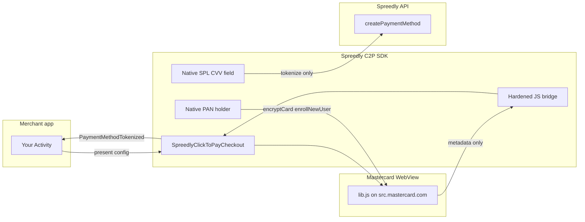

# Click to Pay Integration Guide

A practical guide for integrating Mastercard Click to Pay checkout into your Android app using the
Spreedly SDK `:clicktopay` module.

## Table of Contents

- [Introduction](#introduction)
- [Prerequisites](#prerequisites)
- [Project Setup](#project-setup)
- [How Click to Pay Works](#how-click-to-pay-works)
- [Kotlin Integration](#kotlin-integration)
- [Java Integration](#java-integration)
- [Auto-tokenize](#auto-tokenize)
- [Integration contract](#integration-contract)
- [WebView security](#webview-security)
- [PCI and sensitive data](#pci-and-sensitive-data)
- [Production checklist](#production-checklist)
- [Events and State](#events-and-state)
- [Error Handling](#error-handling)
- [Testing](#testing)
- [Troubleshooting](#troubleshooting)
- [API Reference](#api-reference)

---

## Introduction

Click to Pay (C2P) lets customers pay with saved Mastercard network cards after identity verification
(OTP). The Spreedly Android SDK hosts the Mastercard `lib.js` checkout in a hardened WebView and
bridges MC lifecycle events to your app through `SpreedlyClickToPayCheckout`.

### Key characteristics

- **Pattern B singleton** — call `SpreedlyClickToPayCheckout.present()` from your Activity; only one checkout session is active — a second `present()` finishes the prior activity
- **WebView + native bridge** — MC script runs in `c2p-host.html`; CVV for tokenize stays on the native side
- **Separate module** — MC WebView code is isolated in `:clicktopay`; include `:hostedfields` when using native SPL card fields
- **Optional auto-tokenize** — after MC checkout completes, the SDK can call `SpreedlyClickToPayCheckout.tokenize` and emit `PaymentMethodTokenized`

---

## Prerequisites

1. **Spreedly account** with Click to Pay enabled and a sandbox or production DPA ID (`srcDpaId`)
2. **Spreedly SDK initialized** via `Spreedly.init(options)` with fresh enhanced auth (nonce, signature, timestamp, certificate)
3. **Physical device recommended** for sandbox OTP and DCF (device cardholder flows)
4. See the [Compatibility table](../../README.md#compatibility) in the README for Android API level requirements

---

## Project Setup

### 1. Configure the Maven Repository

Add the Spreedly GitHub Packages repository as described in [Getting Started — Install](getting-started.md#1-install).

### 2. Add dependencies

```kotlin
dependencies {
    implementation("com.spreedly:checkout-clicktopay:$spreedlyVersion")
    // Required when using native SPL card/CVV fields (default checkout UI)
    implementation("com.spreedly:checkout-hostedfields:$spreedlyVersion")
}
```

`:clicktopay` transitively includes `payments-core` (`api` dependency).

### 3. AndroidManifest (automatic)

`ClickToPayCheckoutActivity` is declared in the module manifest and merged into your app. You do not
register it manually.

### 4. No Click to Pay module = zero impact

Without the `:clicktopay` artifact, no C2P classes or WebView assets are packaged in your APK.

---

## How Click to Pay Works

```
┌─────────────┐    ┌──────────────────┐    ┌─────────────┐    ┌──────────┐
│ Merchant App │    │ SpreedlyClickToPay│    │ MC lib.js   │    │ Spreedly │
│              │    │ Checkout (WebView)│    │ (sandbox)   │    │ API      │
└──────┬───────┘    └────────┬─────────┘    └──────┬──────┘    └────┬─────┘
       │                     │                     │                │
       │ present(config)     │                     │                │
       │────────────────────►│ load c2p-host.html  │                │
       │                     │────────────────────►│                │
       │                     │◄── OTP / cards ─────│                │
       │◄── ClickToPayEvent ─│                     │                │
       │                     │                     │                │
       │ (auto-tokenize)     │ SpreedlyClickToPayCheckout.tokenize │
       │                     │──────────────────────────────────────►│
       │◄── PaymentMethodTokenized / paymentResultFlow ──────────────│
```

1. Merchant builds `ClickToPayCheckoutConfig` (DPA ID, customer email/phone, sandbox flag).
2. `present(config, activity)` opens `ClickToPayCheckoutActivity`.
3. WebView loads MC script; orchestrator handles lookup, OTP, card selection, and checkout.
4. Saved cards: MC `src-card-list` in the WebView; SPL CVV and pay stay native in the bottom bar.
5. On success, `ClickToPayEvent.CheckoutComplete` carries `ClickToPayMetadata` (no PAN).
6. The SDK auto-tokenizes with SPL CVV and emits `PaymentMethodTokenized`.

### Lookup flow (iframe parity)

When `doLookup = true` (default), the orchestrator runs:

1. **getCards** — if the device has Remember-me cards, they load immediately.
2. **signOut** (internal) — when getCards is empty and `customer` has email or phone, the SDK clears any stale MC session before profile lookup so OTP targets the entered identity.
3. **idLookup** — MC resolves the consumer profile for that identity.
4. OTP and card list follow idLookup when `consumerPresent` is true; new-user enrollment when false.

There is no `lookupStrategy` config — this sequence matches the Spreedly iFrame default (including sign-out before identity lookup).

### Pre-checkout saved-card detector

Use `ClickToPaySavedCardsDetector` when the merchant screen needs to know whether Remember-me cards exist **before** opening checkout. The primary integration pattern below unmounts the detector before `present()` — follow that same `savedCardsDetectorKey` gate in your screen.

Rules:

- The detector forces `merchantHostedCardList = true` so MC publishes masked metadata only (no `src-card-list` UI in the detector WebView).
- **Unmount the detector** (`savedCardsDetectorKey = -1` or equivalent) and await tear-down **before** `SpreedlyClickToPayCheckout.present(...)`. Two concurrent MC WebViews share process cookies and can race.
- Await tear-down whenever the detector was mounted (`savedCardsDetectorKey >= 0` before unmount), not only when `onControllerReady` has fired. Hold the controller from `onControllerReady` and call `awaitTearDown()` after unmount; if the controller is still null after unmount, await `onDetectorDisposed` (for example via a `CompletableDeferred` completed in that callback) so `present()` does not race ahead. Do **not** rely on `controller?.awaitTearDown()` alone — that no-ops when the controller is null and skips the wait entirely. Prefer `onDetectorDisposed` + `awaitTearDown()`; do not use `withFrameNanos` as the primary tear-down signal. `awaitTearDown()` returns `true` when dispose completed within 5s and `false` on timeout — **do not call `present()` when it returns `false`**; show an error or retry after the detector finishes unmounting.
- `SpreedlyClickToPayCheckout.present()` **rejects** (emits `C2P_INIT` error) while a detector composable is still mounted. Tear down first, then present.
- After checkout completes, cancels, or errors, remount the detector only when `!SpreedlyClickToPayCheckout.isActive` (bump `savedCardsDetectorKey`) so recognition can pick up Remember-me cards saved during that session. If the shopper chose "Not you?", keep the typed-email UI and skip remount until they leave that mode.
- Call `ClickToPaySavedCardsDetectorController.signOut()` when the shopper chooses a different identity ("Not you?").
- Empty wallet: `hasSavedCards = false` and `failure = null`. Timeout / init / error: `hasSavedCards = false` and `failure` set (`Timeout`, `InitFailed`, or `Error`) — do not treat failure as an empty wallet.

---

## Kotlin Integration

### 1. Initialize Spreedly

```kotlin
Spreedly.init(
    context = applicationContext,
    options = SpreedlySDKInitOptions(
        environmentKey = "...",
        // enhanced auth from your backend
        nonce = nonce,
        timestamp = timestamp,
        certificateToken = certificateToken,
        signature = signature,
    ),
)
```

### 2. Subscribe to events

```kotlin
lifecycleScope.launch {
    SpreedlyClickToPayCheckout.events.collect { event ->
        when (event) {
            is ClickToPayEvent.CheckoutComplete -> { /* metadata; SDK auto-tokenizes */ }
            is ClickToPayEvent.PaymentMethodTokenized -> { /* use event.token */ }
            is ClickToPayEvent.Error -> { /* show event.message */ }
            is ClickToPayEvent.CheckoutCancelled -> { }
            else -> { /* OTP, lookup, lifecycle — see ClickToPayEvent KDoc */ }
        }
    }
}
```

### 3. Present checkout

Build config once. On the **store checkout screen**, gate the saved-card detector with a key (`>= 0` mounted, `-1` unmounted) and tear it down before opening checkout:

```kotlin
import androidx.compose.foundation.layout.fillMaxWidth
import androidx.compose.runtime.getValue
import androidx.compose.runtime.mutableIntStateOf
import androidx.compose.runtime.mutableStateOf
import androidx.compose.runtime.remember
import androidx.compose.runtime.setValue
import androidx.compose.ui.Modifier
import com.spreedly.clicktopay.ClickToPayButtonConfig
import com.spreedly.clicktopay.ui.ClickToPaySavedCardsDetector
import com.spreedly.clicktopay.ui.ClickToPaySavedCardsDetectorController
import com.spreedly.clicktopay.ui.SpreedlyClickToPayButton
import kotlinx.coroutines.CompletableDeferred
import kotlinx.coroutines.withTimeoutOrNull

val config =
    ClickToPayCheckoutConfig(
        initConfig = ClickToPayInitConfig(),
        srcDpaId = "your-dpa-id",
        isSandbox = true,
        customer = ClickToPayCustomer(email = "shopper@example.com"),
        dpaPresentationName = "Your Shop",
        dpaName = "Your Shop",
    )

var savedCardsDetectorKey by remember { mutableIntStateOf(0) }
var detectorController by remember {
    mutableStateOf<ClickToPaySavedCardsDetectorController?>(null)
}
var disposeSignal by remember { mutableStateOf(CompletableDeferred<Unit>()) }

if (savedCardsDetectorKey >= 0) {
    ClickToPaySavedCardsDetector(
        config = config, // customer ignored; detector forces customer = null
        detectorKey = savedCardsDetectorKey,
        onControllerReady = { detectorController = it },
        onDetectorDisposed = { disposeSignal.complete(Unit) },
        onResult = { result ->
            when {
                result.hasSavedCards -> { /* Welcome back — result.savedCards */ }
                result.failure != null -> { /* timeout/init/error — not an empty wallet */ }
                else -> { /* no Remember-me cards */ }
            }
        },
    )
}

suspend fun tearDownSavedCardsDetectorIfMounted(): Boolean {
    val wasMounted = savedCardsDetectorKey >= 0
    val controller = detectorController
    val signal = disposeSignal
    detectorController = null
    if (!wasMounted) {
        return true
    }
    disposeSignal = CompletableDeferred()
    savedCardsDetectorKey = -1
    return if (controller != null) {
        controller.awaitTearDown()
    } else {
        withTimeoutOrNull(5_000) { signal.await() } != null
    }
}

// Drop-in src-button (recommended) — await detector tear-down before present()
SpreedlyClickToPayButton(
    checkoutConfig = config,
    buttonConfig = ClickToPayButtonConfig(isDark = isDarkMode), // merchant-provided isDarkMode
    prepareForPresentation = {
        if (!refreshAuthAndValidate()) return@SpreedlyClickToPayButton false // merchant-provided
        if (!tearDownSavedCardsDetectorIfMounted()) return@SpreedlyClickToPayButton false
        true
    },
    modifier = Modifier.fillMaxWidth(),
)
```

**Manual `present()`** — same unmount + `awaitTearDown()` / `onDetectorDisposed` before `present()`:

```kotlin
suspend fun openClickToPay(activity: Activity): Boolean {
    if (!refreshAuthAndValidate()) return false // merchant-provided
    if (!tearDownSavedCardsDetectorIfMounted()) return false
    SpreedlyClickToPayCheckout.present(config, activity)
    return true
}
```

If you cannot wire `onDetectorDisposed`, a single-frame `withFrameNanos { }` after unmount is a last resort only — it does not guarantee WebView detach and can race on slow devices.

### 3a. Merchant entry button (`src-button`)

On your **store checkout screen** (before opening the C2P sheet), use the official Mastercard
[src-button](https://developer.mastercard.com/unified-checkout-solutions/documentation/ui-components/)
component — not a themed Material button.

The [§3 sample](#3-present-checkout) is the safe copy-paste path: `SpreedlyClickToPayButton` with
`prepareForPresentation` that unmounts `ClickToPaySavedCardsDetector` when it was mounted and
awaits tear-down (`awaitTearDown()` and/or `onDetectorDisposed`) before checkout opens.

**Legacy** — manual tap wiring (still await detector tear-down first):

```kotlin
ClickToPayBrandedButton(
    onClick = {
        lifecycleScope.launch {
            tearDownSavedCardsDetectorIfMounted()
            SpreedlyClickToPayCheckout.present(config, activity)
        }
    },
    enabled = checkoutEnabled,
    cardBrands = config.initConfig.cardBrands,
    isSandbox = config.isSandbox,
    locale = config.locale,
    modifier = Modifier.fillMaxWidth(),
)
```

Java merchants can embed the drop-in via [ClickToPayButtonJavaHelper.setupContent]. When a
`ClickToPaySavedCardsDetector` is mounted, use the overload that takes
[ClickToPayPrepareForPresentation] and call `onReady.accept(true)` only after tear-down finishes:

```java
ClickToPayButtonJavaHelper.setupContent(
    composeView,
    config,
    buttonConfig,
    activity,
    onReady -> {
        // Unmount detector, await tear-down on your controller, then on the main thread:
        onReady.accept(true);
    }
);
```

Do not use the deprecated `BooleanSupplier` overload for detector tear-down — it cannot await.

Inside the C2P sheet, `src-card-list` and `src-otp-input` run in the checkout WebView. SPL CVV and
the pay action after card selection stay native (iframe parity). Manual card entry is triggered from
the MC card list — not a duplicate native link.

### Global theme

Click to Pay checkout applies your merchant global theme to sheet chrome (scaffold background,
typography, labels, identity fields). Call `Spreedly.setGlobalTheme()` **before** `present()` — there
is no per-present theme parameter on Click to Pay.

```kotlin
Spreedly.setGlobalTheme(
    SpreedlyTheme(
        colors =
            SpreedlyColors(
                primary = Color(0xFF0052CC),
                background = Color.White,
                text = Color(0xFF18181B),
            ),
    ),
)

SpreedlyClickToPayCheckout.present(config, activity)
```

The checkout activity wraps content in `SpreedlyAdaptiveGlobalTheme` (iOS
`View.spreedlyAdaptiveGlobalTheme()` parity). **Pay actions** inside the sheet use Mastercard SRC
branding (`ClickToPayPrimaryButton`, black background) — not your `primary` color. Use
[ClickToPayBrandedButton] on your store screen for the official `src-button` entry point.

### Remember me

When `ClickToPayOtpConfig.rememberMe` is `true`, the default checkout sheet shows a **Remember me**
toggle on the native saved-card CVV bar. The MC card-list remember-me control stays off to avoid
duplicate toggles. OTP-phase Remember me remains in the MC WebView when configured.

```kotlin
ClickToPayCheckoutConfig(
    // ...
    otp = ClickToPayOtpConfig(rememberMe = true),
)
```

### 4. Cancel

```kotlin
SpreedlyClickToPayCheckout.cancel()
```

---

## Java Integration

Use `SpreedlyClickToPayCheckout` from Kotlin; for Java, collect events on the main thread:

```java
CoroutineScope scope = LifecycleOwnerKt.getLifecycleScope(activity);
BuildersKt.launch(scope, EmptyCoroutineContext.INSTANCE, CoroutineStart.DEFAULT,
    (scope1, continuation) -> {
        FlowKt.collect(
            SpreedlyClickToPayCheckout.INSTANCE.getEvents(),
            event -> {
                if (event instanceof ClickToPayEvent.PaymentMethodTokenized) {
                    String token = ((ClickToPayEvent.PaymentMethodTokenized) event).getToken();
                    // handle token
                }
                return Unit.INSTANCE;
            },
            continuation
        );
        return Unit.INSTANCE;
    });
```

Prefer a thin Kotlin facade in mixed codebases.

---

## Auto-tokenize

After MC checkout COMPLETE, the SDK:

1. Collects CVV on the native saved-card list (SPL field).
2. Calls `SpreedlyClickToPayCheckout.tokenize(metadata, verificationValue, billing)`.
3. Emits `ClickToPayEvent.PaymentMethodTokenized` on success.

MC checkout can outlive your init nonce. Register a refresher before long sessions:

```kotlin
SpreedlyClickToPayCheckout.setAutoTokenizeAuthRefresher {
    // fetch fresh nonce/signature from your backend, call Spreedly.init(), return true on success
    refreshSpreedlyAuth()
}
```

For merchant-hosted saved-card checkout, call `SpreedlyClickToPayCheckout.tokenize()` yourself after
`CheckoutComplete` (see below).

### `CheckoutComplete` and PCI

- `CheckoutComplete` carries `ClickToPayMetadata` only (no PAN, no CVV).
- The SDK retains SPL CVV internally until tokenize completes on the default checkout path.
- Merchant-hosted checkout supplies CVV at `checkoutSelectedCard()` / `tokenize()` call time.

### Merchant-hosted saved-card list

Set `merchantHostedCardList = true` on [ClickToPayCheckoutConfig] to hide the SDK native card list
and render masked cards from [ClickToPayEvent.DisplayCardsReady] in your own UI (iframe `displayCardsEl` parity).

```kotlin
val config =
    ClickToPayCheckoutConfig(
        initConfig = ClickToPayInitConfig(),
        srcDpaId = "your-src-dpa-id",
        customer = ClickToPayCustomer(email = "shopper@example.com"),
        merchantHostedCardList = true,
        dpaPresentationName = "Your Store",
        dpaName = "Your Store",
    )

SpreedlyClickToPayCheckout.present(config, activity)

// After DisplayCardsReady:
SpreedlyClickToPayCheckout.selectCard(card.srcDigitalCardId)
SpreedlyClickToPayCheckout.checkoutSelectedCard(
    srcDigitalCardId = card.srcDigitalCardId,
    verificationValue = cvvFromYourField,
    rememberMe = false,
)
```

`checkoutSelectedCard` maps to iframe `c2pCheckout({ isCheckoutWithCard: true })`. CVV is never logged
or sent over the JS bridge. Call `SpreedlyClickToPayCheckout.tokenize()` after `CheckoutComplete` on
this path.

---

## Integration contract

Mastercard Unified Checkout Solutions (UCS) mobile integration requirements enforced by the SDK:

| Topic | Value |
|-------|-------|
| Lib URL path | `/srci/integration/2/lib.js` (not legacy `/srci/merchant/2/lib.js`) |
| Sandbox base | `https://sandbox.src.mastercard.com` |
| Production base | `https://src.mastercard.com` |
| Query params | `srcDpaId`, `locale` |
| Init payload | `dpaTransactionOptions.paymentOptions[].dynamicDataType = "NONE"` |
| UAT signoff | Spreedly/MC must confirm lib URL and init payload on sandbox before production — track in your release ticket |

Pinned references:

- [UCS getting started](https://developer.mastercard.com/unified-checkout-solutions/documentation/gettingstarted/)
- [Click to Pay use cases](https://developer.mastercard.com/unified-checkout-solutions/documentation/use-cases/click-to-pay/) (recognized, lookup/OTP, first-time user)
- [UCS mobile tutorial](https://developer.mastercard.com/unified-checkout-solutions/tutorial/mobile/)
- [UCS tutorials and guides](https://developer.mastercard.com/unified-checkout-solutions/documentation/tutorials-guides/)
- [UCS mobile SDK reference](https://developer.mastercard.com/unified-checkout-solutions/documentation/sdk-reference/mobile/)
- [UCS UI components / src-button](https://developer.mastercard.com/unified-checkout-solutions/documentation/ui-components/)
- [Android web-native reference app](https://github.com/Mastercard/web-native-integration) (MC sample merchant WebView integration)

Unit tests lock sandbox/prod lib URLs and `dynamicDataType` via `ClickToPayMcSpecFixtures`.

---

## WebView security

Mastercard’s mobile Click to Pay integration requires a WebView host. The SDK hardens that surface:

| Control | Purpose |
|---------|---------|
| `SecureScreen()` | Blocks screenshots / screen recording during checkout |
| HTTPS navigation allowlist | Only `*.src.mastercard.com` hosts (see table below) |
| Explicit scheme deny-list | Blocks `content://`, `file://`, `android.resource://`, `javascript:`, and `intent://` in navigation and subresource loads |
| Inline scheme policy | `about:` and main-frame `data:` pass-through in `shouldInterceptRequest` for `loadDataWithBaseURL` bootstrap; subresource `data:`/`blob:` allowed for MC assets; top-level `data:`/`blob:` navigation blocked in `shouldOverrideUrlLoading`; main-frame `blob:` blocked in `shouldInterceptRequest` |
| `MIXED_CONTENT_NEVER_ALLOW` | Blocks mixed HTTP/HTTPS content |
| Bridge method allowlist + schemas | Rejects unknown `postMessage` methods and malformed payloads |
| Payload value sanitization | Redacts PAN/CVV patterns in accepted bridge string values before orchestrator handling |
| Payload size cap | Rejects oversized bridge messages |
| Forbidden sensitive keys | Bridge payloads cannot carry PAN/CVV keys from JS (normalized key match on objects and arrays) |
| No bridge param retention | Outbound bridge commands are not stored in production |
| `removeJavascriptInterface` on detach | Bridge removed when WebView is destroyed |
| `addJavascriptInterface` | Required by MC SDK for native↔JS communication |
| DCF popup handling | `onCreateWindow` opens a child WebView with the same URL policies and hardened settings |
| Branded button `WebMessageListener` | Mastercard-only `allowedOriginRules` (`https://src.mastercard.com`, `https://*.src.mastercard.com`); rejects non-main-frame and untrusted `sourceOrigin` |
| Branded button message cap | 16 KiB max on `C2pBrandedButtonBridge` postMessage payloads |

### Host allowlist

| Host pattern | Allowed | Notes |
|--------------|---------|-------|
| `sandbox.src.mastercard.com` | Yes | Sandbox MC script and checkout |
| `src.mastercard.com` | Yes | Production MC script and checkout |
| `*.src.mastercard.com` | Yes | MC subdomains (DCF, assets); suffix match rejects typosquat hosts like `evil.src.mastercard.com.evil.com` |
| Any other HTTPS host | No | Blocked in navigation and subresource loads |

### DCF popup WebView

Mastercard device cardholder (DCF) flows may open a child WebView via `onCreateWindow`. The SDK creates a popup with `ClickToPayMcWebViewClient`, `allowContentAccess=false`, and the same scheme deny-list as the host WebView. MC may attach the popup as a hidden window reference (`transport.webView = popup`) without adding it to your layout — this is an accepted MC pattern. Validate DCF completion on a physical device before go-live (see [Testing](#testing)).

### Accepted risks

`addJavascriptInterface` exposes the native bridge to **all frames** in the WebView, not only the
trusted MC origin. Phase guards, method allowlist, payload size cap, sensitive-key filter, value
sanitization, and `removeJavascriptInterface` on detach reduce abuse surface but do not eliminate
it. This is an **accepted risk** of the MC mobile integration model.

Host HTML loads via `loadDataWithBaseURL` with an HTTPS Mastercard base URL. Main-frame `data:`
responses in `shouldInterceptRequest` are required for that bootstrap on device WebViews.
Subresource `data:` loads remain allowed for MC inline assets; top-level navigation to `data:` and
`blob:` stays blocked in `shouldOverrideUrlLoading`, and main-frame `blob:` is blocked in
`shouldInterceptRequest`.

JavaScript, DOM storage, third-party cookies, and multiple windows are enabled because the MC
`lib.js` SDK and DCF flows require them. CVV for tokenize is collected in native SPL fields and
never sent over the JS bridge.

Reference: [Mastercard Unified Checkout Solutions](https://developer.mastercard.com/unified-checkout-solutions/documentation/sdk-reference/mobile/).

---

## PCI and sensitive data



**PCI scope:** PCI scope depends on the merchant integration, deployment model, and assessor
interpretation. The saved-card path is designed to minimize merchant PAN exposure because
Mastercard hosts card data and the SDK only uses native CVV for tokenization, but this guide does
**not** assert SAQ-A eligibility. Merchants should confirm their applicable PCI scope with their
QSA, acquirer, and Spreedly compliance guidance.

**Enrollment and new-card paths** briefly pass PAN/CVV through native memory into the trusted MC
WebView for `encryptCard` / `enrollNewUser`. Those paths require formal PCI scope review and
Spreedly/compliance signoff before production.

**Sensitive data policy:** No PAN or CVV should be logged, persisted, parceled, or emitted in
public events. The saved-card flow still handles CVV transiently in native SPL fields; new-card and
enrollment flows handle PAN/CVV transiently before sending to the Mastercard WebView.

During enrollment and new-card checkout the SDK briefly holds PAN/CVV in native memory and passes
them to the trusted Mastercard WebView host via `evaluateJavascript` for MC `encryptCard` /
`enrollNewUser`. The WebView host runs only on Mastercard HTTPS origins with hardened settings
(no file/content access, scheme deny-list, bridge method allowlist). Sensitive data is cleared on
checkout complete, cancel, failure, WebView detach, and MC checkout branch actions (`CANCEL`,
`CHANGE_CARD`, `ADD_CARD`, `SWITCH_CONSUMER`, missing/unknown action codes).

| Data | Where it flows | Merchant exposure |
|------|----------------|-------------------|
| MC metadata (flow/correlation IDs) | `CheckoutComplete` event | Safe to persist |
| CVV | Native SPL field → internal tokenize path | Never on public events |
| Payment method token | `PaymentMethodTokenized` event / `paymentResultFlow` | Use `event.token`; never log the event (`toString` redacts token and nested `paymentMethod`) |
| Sandbox test PAN/CVV | `sandboxEnrollmentCard` config | Sandbox only; in-memory holder (not `Parcelable`); rejected in production |

### Sensitive data flow by mode

| Mode | Where PAN lives | Where CVV lives | Clearing trigger |
|------|-----------------|-----------------|------------------|
| MC WebView (saved card) | MC SDK only (never crosses bridge) | Native SPL field → tokenize | Checkout complete, cancel, fail, detach |
| MC WebView (new card + enroll) | Native memory → JS command to trusted MC WebView → `encryptCard` → MC | Native memory → JS command to trusted MC WebView → `enrollNewUser` → MC | Checkout complete, cancel, fail, detach |
| Sandbox enrollment | `sandboxEnrollmentCard` (in-memory, non-Parcelable) | `sandboxEnrollmentCard` | Checkout complete, cancel, fail, detach; rejected if `isSandbox=false` |

`sandboxEnrollmentCard` is ignored unless `isSandbox = true`. `present()` fails fast if production
config includes a sandbox enrollment card.

### Checkout rotation and sensitive state

During an active MC checkout phase, configuration rotation retains in-memory sensitive state
(CVV draft, pending verification value, SPL field buffers) so checkout can resume after
`onConfigurationChanged`. State is cleared on checkout complete, cancel, failure, sign-out, and
WebView detach when checkout is not active. CVV and PAN are not written to `Bundle`,
`SavedStateHandle`, analytics, or public events. Backgrounding the app mid-checkout may leave
sensitive state in process memory until one of those clear paths runs — treat background/task
removal as abandoning the checkout session.

---

## Production checklist

- [ ] Use `isSandbox = false` and production `srcDpaId` in release builds
- [ ] Register `setAutoTokenizeAuthRefresher` when MC checkout may outlive init nonce
- [ ] Do not log `ClickToPayEvent` payloads or bridge traffic
- [ ] Omit `sandboxEnrollmentCard` from production configs
- [ ] Include `:hostedfields` when using native SPL card fields
- [ ] Test OTP and DCF on physical devices before go-live
- [ ] Do not override `shouldOverrideUrlLoading` or `shouldInterceptRequest` if subclassing
- [ ] Do not disable `allowContentAccess=false`, `allowFileAccess=false` defaults
- [ ] Verify `SecureScreen()` is active during checkout on physical devices

---

## Events and State

| API | Purpose |
|-----|---------|
| `SpreedlyClickToPayCheckout.events` | `SharedFlow<ClickToPayEvent>` — iframe-parity lifecycle |
| `SpreedlyClickToPayCheckout.state` | `StateFlow<ClickToPayFlowState>` — UI phase, masked cards, OTP flags |
| `Spreedly.paymentResultFlow` | Emits `PaymentResult` when auto-tokenize or manual `SpreedlyClickToPayCheckout.tokenize` completes |

Public lookup and OTP helpers (active checkout only):

- `SpreedlyClickToPayCheckout.lookup(customer)`
- `SpreedlyClickToPayCheckout.selectCard(srcDigitalCardId)` — merchant-hosted card list selection
- `SpreedlyClickToPayCheckout.checkoutSelectedCard(srcDigitalCardId, verificationValue, rememberMe?)` — saved-card checkout
- `SpreedlyClickToPayCheckout.selectOtpChannel(channelId)`
- `SpreedlyClickToPayCheckout.signOut(onComplete)`

Datadog checkout timing events (`click_to_pay_checkout_started` / `click_to_pay_checkout_completed`)
are declared in `payments-core` as `SpreedlyEvent` types for schema stability and emitted by
`:clicktopay` only — the same cross-module telemetry pattern as APM checkout events. No C2P
checkout logic lives in `payments-core`.

---

## Error Handling

Merchant-facing errors use **two layers** before they reach `ClickToPayEvent.Error`:

1. **JavaScript (`c2p-host.html`)** — `formatMcError` / `postError` emit only allowlisted fields
   (`reason`, `message`, `code`, bounded `error` string). Raw MC error objects are never
   `JSON.stringify`'d onto the bridge.
2. **Native ingress** — `ClickToPayBridgeIngress` rejects forbidden keys (including hyphenated and
   snake_case variants), then `ClickToPayBridgePayloadSanitizer` redacts Luhn-valid PAN sequences
   and CVV-in-context patterns in accepted string values. `mcErrorMessage()` applies the same
   sanitizer before emitting the merchant string.

Do not rely on raw gateway strings for PCI-sensitive display.

| Source | Merchant message |
|--------|------------------|
| MC bridge failure | Sanitized MC reason/message or `"Payment error"` |
| `SpreedlyClickToPayCheckout.tokenize` failure | `"Tokenize failed"` |
| Missing CVV for auto-tokenize | `"CVV required for tokenize"` |
| Expired auth before tokenize | Prompt to refresh nonce and re-init |

Handle `ClickToPayErrorCode` on `ClickToPayEvent.Error` for analytics bucketing.

---

## Testing

- **Unit tests** — orchestrator, bridge ingress, URL policy, and sanitizers run on Robolectric in CI.
- **Sandbox** — use MC sandbox DPA ID and test emails from your Spreedly/MC documentation.
- **Device QA** — OTP, DCF popups, and full checkout require a physical device before go-live.

Demo app route: Main menu → **Click to Pay** (`clicktopay_demo`).

---

## Troubleshooting

| Symptom | Check |
|---------|--------|
| `Spreedly.init() required` on present | Initialize SDK before `present()` |
| Tokenize fails after long checkout | `setAutoTokenizeAuthRefresher` + fresh enhanced auth |
| OTP never arrives | Sandbox email/phone; device network; MC sandbox status |
| Stale Remember-me cards | `SpreedlyClickToPayCheckout.signOut()` |
| Blank card list on new email | Confirm `customer` email/phone on config; call `lookup(customer)` during checkout |

---

## API Reference

Primary entry points:

- `SpreedlyClickToPayCheckout` — `present`, `cancel`, `events`, `state`
- `SpreedlyClickToPayButton` — recommended drop-in `src-button`. Pass `prepareForPresentation` whenever a `ClickToPaySavedCardsDetector` is (or was) mounted so tear-down completes before `present`; omit only when no detector is used
- `ClickToPayButtonJavaHelper.setupContent` — Java drop-in; use `ClickToPayPrepareForPresentation` when a detector must be torn down before present
- `ClickToPaySavedCardsDetector` — pre-checkout Remember-me detection (must unmount before `present`; SDK rejects concurrent mount)
- `ClickToPaySavedCardsDetectorController.awaitTearDown()` — returns `true` when dispose completed within 5s; returns `false` on timeout (do not call `present()` when `false`)
- `Spreedly.setGlobalTheme()` — merchant theme for C2P sheet chrome (via `SpreedlyAdaptiveGlobalTheme`)
- `ClickToPayCheckoutConfig` — DPA ID, customer, OTP, `doLookup`
- `SpreedlyClickToPayCheckout.tokenize` — manual tokenize (`:clicktopay`)
- `ClickToPayMetadata` — MC checkout metadata (`com.spreedly.clicktopay.tokenize`)

Generated KDoc: `./gradlew generateApiDocs`
