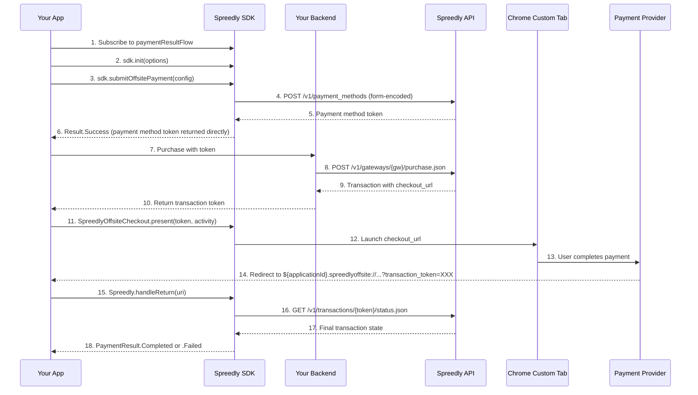

# Offsite Payment Integration Guide

A practical guide for integrating offsite payment methods (PayPal, Pix, SPREL, Boleto, etc.) into
your Android app using the Spreedly SDK and Chrome Custom Tabs.

## Table of Contents

- [Introduction](#introduction)
- [Offsite vs Standard Payments](#offsite-vs-standard-payments)
- [Supported Payment Methods](#supported-payment-methods)
- [Prerequisites](#prerequisites)
- [Project Setup](#project-setup)
- [SDK Initialization](#sdk-initialization)
- [Implementing the Offsite Flow](#implementing-the-offsite-flow)
- [EBANX Integration](#ebanx-integration)
- [UI Integration (Jetpack Compose)](#ui-integration-jetpack-compose)
- [Java Integration](#java-integration)
- [Deep Link Return Handling](#deep-link-return-handling)
- [Chrome Custom Tab Dismissal](#chrome-custom-tab-dismissal)
- [Testing Your Integration](#testing-your-integration)
- [Backend Requirements](#backend-requirements)
- [Troubleshooting](#troubleshooting)
- [API Reference](#api-reference)

---

## Introduction

### What are Offsite Payments?

Offsite payments are payment methods where the customer is redirected to an external provider's website to complete the transaction. Unlike standard credit card payments which are handled entirely within your app, offsite payments require a browser-based checkout step.

### How It Works

The Spreedly SDK uses **Chrome Custom Tabs** to present the external provider's checkout page. After the customer completes payment, the provider redirects back to your app via a custom URL scheme deep link.

### Key Features

- **Chrome Custom Tabs** - Fast, in-app browser experience (no app switching)
- **Deep Link Returns** - Seamless return to your app after checkout
- **Manual Close Handling** - Graceful handling when the user taps the "X" button
- **Transaction Status Verification** - Automatic status polling after return
- **Kotlin & Java Support** - Full interop for both languages

---

## Offsite vs Standard Payments

| Feature | Standard (Credit Card) | Offsite Payment |
|---------|----------------------|-----------------|
| **Input** | Card number, CVV, expiry | Provider selection, optional customer info |
| **Tokenization** | JSON request | Form-encoded request |
| **Checkout** | In-app UI | Chrome Custom Tab (external browser) |
| **Return** | Immediate result | Deep link redirect |
| **PaymentResult.paymentMethodResponse** | Always present | Nullable (not available after redirect) |
| **PaymentResult.state** | Not used | Contains transaction state (e.g., `succeeded`, `pending`) |

---

## Supported Payment Methods

The SDK supports the following offsite payment method types via `OffsitePaymentMethodType`:

### Global Payment Methods

| Type         | Enum Value | Description                   |
|--------------|------------|-------------------------------|
| PayPal       | `PAYPAL`   | PayPal payments               |
| SPREL (Test) | `SPREL`    | Spreedly test offsite gateway |

### Stripe APM (Alternative Payment Methods)

| Type       | Module    | Description                                      |
|------------|-----------|--------------------------------------------------|
| iDEAL      | `:stripe` | Dutch bank transfers via Stripe PaymentSheet      |
| Bancontact | `:stripe` | Belgian payments via Stripe PaymentSheet          |
| EPS        | `:stripe` | Austrian bank transfers via Stripe PaymentSheet   |
| Przelewy24 | `:stripe` | Polish bank transfers via Stripe PaymentSheet     |
| SEPA Debit | `:stripe` | European direct debit via Stripe PaymentSheet     |

> **Note:** Stripe APM uses a separate `:stripe` module with the native Stripe SDK.
> It skips tokenization entirely — the backend creates a pending purchase with
> `payment_method_type: "stripe_apm"` directly, and the SDK presents the native Stripe
> PaymentSheet. It is **not** part of `OffsitePaymentMethodType`. See the
> dedicated [Stripe APM Integration Guide](stripe-apm.md)
> for full details.

### Braintree Payments (PayPal & Venmo)

| Type   | Module       | Description                              |
|--------|--------------|------------------------------------------|
| PayPal | `:braintree` | PayPal payments via native Braintree SDK |
| Venmo  | `:braintree` | Venmo payments via native Braintree SDK  |

> **Note:** Braintree PayPal/Venmo uses a separate `:braintree` module with the native Braintree
> SDK.
> It returns a payment **nonce** that the merchant must send to their backend to call Spreedly's
> `/confirm.json` endpoint. See the
> dedicated [Braintree APM Integration Guide](braintree-apm.md)
> for full details.

### EBANX Payment Methods (Latin America)

EBANX is a leading payment provider for Latin America, supporting multiple local payment methods.

| Type | Enum Value | Country | Currency | Description |
|------|-----------|---------|----------|-------------|
| Pix | `PIX` | Brazil | BRL | Brazilian instant payment system (real-time) |
| Boleto Bancario | `BOLETO_BANCARIO` | Brazil | BRL | Brazilian bank slip payment (offline) |
| NuPay | `NUPAY` | Brazil | BRL | Nubank Pay |
| OXXO | `OXXO` | Mexico | MXN | Mexican cash payment at OXXO stores (offline) |

> Additional EBANX payment methods may be added in future releases.
> Contact Spreedly support for the latest supported methods.

---

## Prerequisites

### Minimum Requirements

See the [Compatibility table](../../README.md#compatibility) in the README for current version requirements (Android API level, Kotlin, Gradle, JDK).

### Required Dependencies

- **Spreedly Android SDK**: Latest version
- **AndroidX Browser**: For Chrome Custom Tabs
- **Coroutines**: For async operations

### Spreedly Environment

Ensure your Spreedly environment is configured with an offsite payment gateway:

1. Log in to [Spreedly](https://core.spreedly.com)
2. Add an offsite payment gateway (e.g., SPREL for testing)
3. Obtain your environment key

---

## Project Setup

### Step 1: Configure the Maven Repository

Add the Spreedly Maven repository to your `settings.gradle.kts` as described in
[Getting Started — Install](getting-started.md#1-install).

> **Tip:** For CI/CD and team environments, store GitHub credentials as Gradle
> properties (`gpr.usr`, `gpr.key` in `gradle.properties`) or environment
> variables (`GITHUB_USERNAME`, `GITHUB_TOKEN`) instead of hardcoding them.

### Step 2: Add Dependencies

The base SDK dependency is listed in [Getting Started — Install](getting-started.md#1-install).
For offsite payments, also add Chrome Custom Tabs:

```kotlin
dependencies {
    implementation("com.spreedly:checkout-payments-core:$spreedlyVersion")
    implementation("androidx.browser:browser:1.8.0")
}
```

> **For Stripe APM or Braintree APM**, see their dedicated integration guides for module-specific
> setup:
> [Stripe APM Integration Guide](stripe-apm.md) |
> [Braintree APM Integration Guide](braintree-apm.md)

### Step 3: Redirect URL Setup

The SDK provides an `OffsiteReturnActivity` with scheme `${applicationId}.spreedlyoffsite` automatically — you do not need to create or register a return activity.

Use `SpreedlyOffsiteCheckout.deepLinkScheme(context)` and `SpreedlyOffsiteCheckout.redirectUrl(context)` to obtain the correct redirect URL for your purchase API calls:

```kotlin
import com.spreedly.sdk.ui.offsite.SpreedlyOffsiteCheckout

// Scheme: e.g. "com.your.app.spreedlyoffsite"
val scheme = SpreedlyOffsiteCheckout.deepLinkScheme(context)

// Full redirect URL: e.g. "com.your.app.spreedlyoffsite://checkout"
val redirectUrl = SpreedlyOffsiteCheckout.redirectUrl(context)

// With custom path (e.g. for EBANX): "com.your.app.spreedlyoffsite://ebanx/checkout"
val ebanxRedirectUrl = SpreedlyOffsiteCheckout.redirectUrl(context, "ebanx/checkout")
```

Pass the redirect URL to your backend when creating the purchase. The SDK-owned `OffsiteReturnActivity` receives the deep link and handles the return flow automatically.

---

## SDK Initialization

For the basic initialization pattern, see [Getting Started — Initialize the SDK](getting-started.md#2-initialize-the-sdk).
Auth params (`nonce`, `signature`, etc.) are single-use — re-fetch them for each payment attempt.

```kotlin
import com.spreedly.sdk.Spreedly
import com.spreedly.sdk.SpreedlySDKInitOptions

data class OffsitePaymentUiState(
    val selectedProvider: OffsitePaymentMethodType? = null,
    val isLoading: Boolean = false,
    val formattedAmount: String = "$0.00",
    val successMessage: String? = null,
    val errorMessage: String? = null,
)

class OffsitePaymentViewModel(
    private val activity: Activity
) : ViewModel() {

    val sdk = Spreedly()

    private val _uiState = MutableStateFlow(OffsitePaymentUiState())
    val uiState: StateFlow<OffsitePaymentUiState> = _uiState.asStateFlow()

    fun selectProvider(type: OffsitePaymentMethodType) {
        _uiState.update { it.copy(selectedProvider = type) }
    }

    fun initializeSdk() {
        viewModelScope.launch {
            try {
                val authParams = getAuthParamsFromBackend()

                val options = SpreedlySDKInitOptions(
                    nonce = authParams.nonce,
                    signature = authParams.signature,
                    certificateToken = authParams.certificateToken,
                    timestamp = authParams.timestamp.toString(),
                    environmentKey = BuildConfig.ENVIRONMENT_KEY,
                    context = activity.applicationContext,
                )
                sdk.init(options)
            } catch (e: Exception) {
                _uiState.update { it.copy(errorMessage = e.message) }
            }
        }
    }

    fun startPayment() {
        viewModelScope.launch {
            _uiState.update { it.copy(isLoading = true, errorMessage = null) }
            try {
                initializeSdk()
                // Tokenize and purchase via your backend, then present checkout
                // SpreedlyOffsiteCheckout.present(transactionToken, activity)
            } catch (e: Exception) {
                _uiState.update { it.copy(isLoading = false, errorMessage = e.message) }
            }
        }
    }
}
```

**Key Points:**
- Authentication parameters are time-limited and must be fetched per payment attempt
- Call `sdk.init(options)` each time before starting a new payment
- Pass `applicationContext` to avoid leaking Activity references

---

## Implementing the Offsite Flow

### Overview: The Complete Flow



### Step-by-Step Implementation

#### Step 1: Subscribe to Payment Results (BEFORE Payment)

**Critical:** Always set up result collection BEFORE initiating the payment.

```kotlin
init {
    observePaymentResults()
}

private var resultObserverJob: Job? = null

private fun observePaymentResults() {
    resultObserverJob?.cancel()
    resultObserverJob = viewModelScope.launch {
        sdk.paymentResultFlow.collect { result ->
            when (result) {
                is PaymentResult.Completed -> {
                    val state = result.state // e.g., "succeeded", "pending"
                    val token = result.token
                    handleCompletion(state, token)
                }
                is PaymentResult.Failed -> {
                    val message = result.message ?: "Payment failed"
                    val state = result.state // e.g., "gateway_processing_failed"
                    handleFailure(message, state)
                }
                PaymentResult.Canceled -> {
                    handleCancellation()
                }
                PaymentResult.Initial -> {
                    // Initial state - no action needed
                }
            }
        }
    }
}
```

#### Step 2: Tokenize the Offsite Payment Method

Create an `OffsitePaymentConfig` and call `submitOffsitePayment()`:

```kotlin
import com.spreedly.sdk.models.offsite.OffsitePaymentConfig
import com.spreedly.sdk.models.offsite.OffsitePaymentMethodType
import com.spreedly.sdk.models.offsite.DocumentId

suspend fun tokenizeOffsitePayment(): String? {
    val config = OffsitePaymentConfig(
        paymentMethodType = OffsitePaymentMethodType.SPREL,
        email = "customer@example.com",
        fullName = "Ana Santos Araujo",
        documentId = DocumentId.standard("853.513.468-93"),
        country = "BR",
        phoneNumber = "8522847035",
        address1 = "Rua E, 1040",
        city = "Maracanaú",
        state = "CE",
        zip = "12345",
    )

    return when (val result = sdk.submitOffsitePayment(config)) {
        is Result.Success -> {
            val paymentMethodToken = result.data.transaction.paymentMethod.token
            paymentMethodToken
        }
        is Result.Error -> {
            // Handle tokenization error
            null
        }
    }
}
```

**PayPal Special Case:** For PayPal, only `paymentMethodType` is sent. All customer fields (email, name, address) are ignored by the API:

```kotlin
val paypalConfig = OffsitePaymentConfig(
    paymentMethodType = OffsitePaymentMethodType.PAYPAL,
)
```

**Document ID:** For payment methods requiring a document identifier (CPF, CNPJ, etc.):

```kotlin
// Standard document_id field
val standardDoc = DocumentId.standard("853.513.468-93")

// Custom key (e.g., "cpf")
val customDoc = DocumentId.custom("cpf", "853.513.468-93")
```

#### Step 3: Call Purchase API on Your Backend

Send the payment method token to your backend to create a purchase.
Pass the `gateway` parameter to select the payment provider (omit it or pass `null` to use
the default test gateway):

```kotlin
suspend fun purchaseWithToken(
    paymentMethodToken: String,
    gateway: String? = null, // e.g. "paypal", or null for the default test gateway
): String? {
    val response = purchaseApiClient.purchase(
        gateway = gateway,
        paymentMethodToken = paymentMethodToken,
        amount = 4400, // Amount in cents ($44.00)
        currencyCode = "USD",
        redirectUrl = SpreedlyOffsiteCheckout.redirectUrl(context),
    )

    return response.transaction?.token
}
```

**Important:** Use `SpreedlyOffsiteCheckout.redirectUrl(context)` (or `redirectUrl(context, path)` for custom paths) so the redirect URL matches the SDK-owned `OffsiteReturnActivity` scheme `${applicationId}.spreedlyoffsite`.

#### Step 4: Launch Chrome Custom Tab Checkout

Use `SpreedlyOffsiteCheckout.present()` to launch the checkout:

```kotlin
import com.spreedly.sdk.ui.offsite.SpreedlyOffsiteCheckout

fun launchCheckout(transactionToken: String) {
    SpreedlyOffsiteCheckout.present(transactionToken, activity)
}
```

This method:
1. Fetches the transaction status to obtain the `checkout_url`
2. Launches a Chrome Custom Tab with the checkout URL
3. Registers a dismiss handler for cleanup

#### Step 5: Handle the Return

The return is handled automatically by the SDK-owned `OffsiteReturnActivity`. When the payment provider redirects back:

1. The SDK's `OffsiteReturnActivity` receives the deep link (scheme `${applicationId}.spreedlyoffsite`)
2. It calls `Spreedly.shared().handleReturn(uri)`
3. The SDK extracts the transaction token and checks the transaction status
4. The result is emitted through `paymentResultFlow`
5. The Chrome Custom Tab is dismissed

---

## UI Integration (Jetpack Compose)

### Complete Compose Example

```kotlin
@Composable
fun OffsitePaymentScreen(
    viewModel: OffsitePaymentViewModel = viewModel()
) {
    val uiState by viewModel.uiState.collectAsState()
    val lifecycleOwner = LocalLifecycleOwner.current

    // Handle Chrome Custom Tab manual close (user taps X)
    DisposableEffect(lifecycleOwner) {
        val observer = LifecycleEventObserver { _, event ->
            if (event == Lifecycle.Event.ON_RESUME) {
                SpreedlyOffsiteCheckout.finalizeIfActive()
            }
        }
        lifecycleOwner.lifecycle.addObserver(observer)
        onDispose { lifecycleOwner.lifecycle.removeObserver(observer) }
    }

    Column(
        modifier = Modifier
            .fillMaxSize()
            .padding(16.dp)
    ) {
        // Provider selection
        Text("Select Provider", style = MaterialTheme.typography.titleMedium)
        Row(horizontalArrangement = Arrangement.spacedBy(8.dp)) {
            OffsitePaymentMethodType.entries.forEach { type ->
                FilterChip(
                    selected = uiState.selectedProvider == type,
                    onClick = { viewModel.selectProvider(type) },
                    label = { Text(type.name) },
                )
            }
        }

        Spacer(modifier = Modifier.height(16.dp))

        // Pay button
        Button(
            onClick = { viewModel.startPayment() },
            modifier = Modifier.fillMaxWidth(),
            enabled = !uiState.isLoading,
        ) {
            if (uiState.isLoading) {
                CircularProgressIndicator(modifier = Modifier.size(24.dp))
                Spacer(modifier = Modifier.width(8.dp))
                Text("Processing...")
            } else {
                Text("Pay ${uiState.formattedAmount}")
            }
        }

        // Success message
        uiState.successMessage?.let { message ->
            Card(
                colors = CardDefaults.cardColors(
                    containerColor = MaterialTheme.colorScheme.tertiaryContainer
                )
            ) {
                Text(text = message, modifier = Modifier.padding(16.dp))
            }
        }

        // Error message
        uiState.errorMessage?.let { message ->
            Card(
                colors = CardDefaults.cardColors(
                    containerColor = MaterialTheme.colorScheme.errorContainer
                )
            ) {
                Text(
                    text = message,
                    modifier = Modifier.padding(16.dp),
                    color = MaterialTheme.colorScheme.onErrorContainer,
                )
            }
        }
    }
}
```

### Stage Indicator Pattern

The example app uses a four-stage indicator to show payment progress:

| Stage | Description | When Active |
|-------|-------------|-------------|
| **Idle** | Waiting for user action | Initial state |
| **Tokenize** | Creating payment method token | `submitOffsitePayment()` in progress |
| **Purchase** | Calling backend purchase API | Purchase API call in progress |
| **Checkout** | User completing payment in browser | Chrome Custom Tab is open |

---

## Java Integration

The SDK provides Java-compatible APIs for offsite payments.

### Java Example Activity

```java
import com.spreedly.sdk.Spreedly;
import com.spreedly.sdk.SpreedlySDKInitOptions;
import com.spreedly.sdk.models.offsite.OffsitePaymentConfig;
import com.spreedly.sdk.models.offsite.OffsitePaymentMethodType;
import com.spreedly.sdk.ui.offsite.OffsitePaymentJavaHelper;
import com.spreedly.sdk.ui.PaymentResult;

public class JavaOffsitePaymentActivity extends AppCompatActivity {

    private Spreedly sdk;

    @Override
    protected void onCreate(Bundle savedInstanceState) {
        super.onCreate(savedInstanceState);
        setContentView(R.layout.activity_java_offsite_payment);

        sdk = new Spreedly();
        startPaymentResultMonitoring();
    }

    private void startPaymentResultMonitoring() {
        // Start monitoring BEFORE initiating any payment.
        // Uses Consumer/Runnable callbacks (java.util.function).
        OffsitePaymentJavaHelper.startPaymentResultMonitoring(
            this, // LifecycleOwner
            sdk,
            result -> {
                // PaymentResult.Completed — checkout finished
                runOnUiThread(() ->
                    showSuccess("Payment completed! State: " + result.getState())
                );
            },
            result -> {
                // PaymentResult.Failed
                runOnUiThread(() ->
                    showError("Payment failed: " + result.getDescription())
                );
            },
            () -> {
                // PaymentResult.Canceled
                runOnUiThread(() -> showError("Payment canceled"));
            }
        );
    }

    private void startPayment() {
        // 1. Re-initialize SDK with fresh auth params (single-use)
        initializeSDKWithFreshAuth(() -> {
            // 2. Build config
            OffsitePaymentConfig config = new OffsitePaymentConfig(
                OffsitePaymentMethodType.SPREL,
                null, // redirectUrl
                "test@example.com",
                "Test User",
                null, null, null, "US", null, null,
                "123 Main St", null, "San Francisco", "CA", "94105"
            );

            // 3. Tokenize the offsite payment method
            OffsitePaymentJavaHelper.submitOffsitePayment(
                this, // LifecycleOwner
                sdk,
                config,
                paymentMethodToken -> {
                    // Success — proceed to purchase on your backend
                    runOnUiThread(() -> proceedToPurchase(paymentMethodToken));
                },
                error -> {
                    // Failed
                    runOnUiThread(() -> showError(error));
                }
            );
        });
    }

    private void proceedToPurchase(String paymentMethodToken) {
        // Call your backend to create a purchase, then launch checkout
        // with the transaction token from the purchase response
        String transactionToken = "..."; // from your backend
        OffsitePaymentJavaHelper.presentCheckout(transactionToken, this);
    }

    @Override
    protected void onResume() {
        super.onResume();
        // Handle manual Chrome Custom Tab close
        OffsitePaymentJavaHelper.finalizeIfActive();
    }
}
```

**Important Java Notes:**
- Use `OffsitePaymentJavaHelper` to bridge Kotlin coroutines to Java callbacks
- All helper methods are `@JvmStatic` — call directly on the class (no `.INSTANCE` needed)
- Callbacks use `Consumer<T>` and `Runnable` from `java.util.function`
- `submitOffsitePayment` requires a `LifecycleOwner` as its first parameter
- SDK initialization with fresh auth params is required per payment (auth params are single-use)
- You can also access `SpreedlyOffsiteCheckout` directly via `.INSTANCE` if preferred

---

## Deep Link Return Handling

### URL Format

The payment provider redirects to your app using the SDK-owned scheme `${applicationId}.spreedlyoffsite`:

```
{applicationId}.spreedlyoffsite://checkout?transaction_token=XXX
```

or:

```
{applicationId}.spreedlyoffsite://checkout?code=XXX
```

Example: `com.your.app.spreedlyoffsite://checkout?transaction_token=XXX`

The SDK supports both `transaction_token` and `code` query parameters.

### How the SDK Processes Returns

When `handleReturn(uri)` is called:

1. **Extract Token** - Parses `transaction_token` or `code` from the URL
2. **Check Status** - Calls Spreedly's status API (`/v1/transactions/{token}/status.json`)
3. **Map Result** - Converts the transaction state to `PaymentResult`:

| Transaction State | PaymentResult |
|-------------------|---------------|
| `succeeded`, `complete` | `PaymentResult.Completed` |
| `failed`, `gateway_processing_failed`, `gateway_processing_result_unknown`, `gateway_setup_failed` | `PaymentResult.Failed(API_ERROR)` |
| `pending`, `processing` | `PaymentResult.Failed(UNKNOWN_ERROR)` |
| No transaction data | `PaymentResult.Failed(UNKNOWN_ERROR)` |

> **Note on `gateway_processing_result_unknown`:** This state indicates a communication issue
> with the gateway where the actual result is uncertain. Merchants should verify the
> transaction outcome server-side before treating this as a definitive failure.

4. **Emit Result** - Publishes through `paymentResultFlow`
5. **Cleanup** - Calls the dismiss handler and clears checkout state

---

## Chrome Custom Tab Dismissal

### Redirect-Based Dismissal (Normal Flow)

When the provider redirects to your deep link URL:

1. The SDK-owned `OffsiteReturnActivity` opens
2. It calls `Spreedly.handleReturn(uri)` (processes return asynchronously)
3. It starts the calling Activity with `FLAG_ACTIVITY_CLEAR_TOP | FLAG_ACTIVITY_SINGLE_TOP`
4. This brings your Activity to the foreground and removes the CCT from the stack
5. `OffsiteReturnActivity` finishes itself

### Manual Close Handling (User Taps X)

If the user taps the "X" (close) button on the Chrome Custom Tab without completing payment:

1. The CCT closes and your Activity's `onResume` is called
2. In `onResume`, call `SpreedlyOffsiteCheckout.finalizeIfActive()`
3. The SDK checks the transaction status
4. If the transaction hasn't completed, a `PaymentResult.Failed` is emitted with the current state

**Jetpack Compose:**

```kotlin
DisposableEffect(lifecycleOwner) {
    val observer = LifecycleEventObserver { _, event ->
        if (event == Lifecycle.Event.ON_RESUME) {
            SpreedlyOffsiteCheckout.finalizeIfActive()
        }
    }
    lifecycleOwner.lifecycle.addObserver(observer)
    onDispose { lifecycleOwner.lifecycle.removeObserver(observer) }
}
```

**Traditional Activity / Java:**

```kotlin
override fun onResume() {
    super.onResume()
    SpreedlyOffsiteCheckout.finalizeIfActive()
}
```

**Thread Safety:** `SpreedlyOffsiteCheckout` uses synchronized access internally. It is safe to call `finalizeIfActive()` multiple times; the `hasFinalized` guard ensures only one status check is performed.

---

## Testing Your Integration

### Using the SPREL Test Gateway

SPREL is Spreedly's test offsite payment gateway. It provides a simulated checkout page for testing the full flow.

### Test Configuration

```kotlin
val testConfig = OffsitePaymentConfig(
    paymentMethodType = OffsitePaymentMethodType.SPREL,
    email = "test@example.com",
    fullName = "Test User",
    documentId = DocumentId.standard("123456789"),
    country = "BR",
)
```

### Testing Flow

1. **Start your app** and navigate to the offsite payment screen
2. **Select a provider** (e.g., SPREL)
3. **Select a product** to purchase
4. **Tap "Pay"** to initiate the flow
5. **Verify tokenization** - Check that the payment method is created
6. **Verify purchase** - Check that the transaction is created
7. **Verify Custom Tab** - The SPREL test page should appear
8. **Complete checkout** - Follow the test page instructions
9. **Verify return** - Your app should receive the result
10. **Verify result** - Check the `PaymentResult` state

### Debug Logging

Check logcat for SDK activity:

```bash
adb logcat | grep -E "(Spreedly|SpreedlyOffsiteCheckout|OffsiteReturn)"
```

Key log messages to look for:
- `"Submitting offsite payment method"` - Tokenization started
- `"Offsite payment method created successfully"` - Token received
- `"Present called with transaction"` - Checkout launch
- `"Launching Custom Tab"` - Browser opened
- `"Handling offsite return URL"` - Deep link received
- `"Extracted transaction token"` - Token parsed from URL
- `"Publishing payment result"` - Final result

---

## Backend Requirements

### Authentication Parameters API

Your backend must provide an endpoint to fetch fresh authentication parameters:

**Request:**

```
GET /api/v1/auth/params
```

**Response:**

```json
{
    "nonce": "abc123...",
    "signature": "def456...",
    "certificate_token": "ghi789...",
    "timestamp": 1708200000
}
```

**Important:** These parameters are single-use. Fetch fresh parameters for each payment attempt.

### Purchase API

Your backend must implement a purchase endpoint that calls the Spreedly gateway API:

**Android App Request:**

```json
POST /api/v1/purchase

{
    "payment_method_token": "PMToken123",
    "amount": 4400,
    "currency_code": "USD",
    "redirect_url": "{applicationId}.spreedlyoffsite://checkout"
}
```

**Your Backend Request to Spreedly:**

```json
POST https://core.spreedly.com/v1/gateways/{gateway_token}/purchase.json

{
    "transaction": {
        "payment_method_token": "PMToken123",
        "amount": 4400,
        "currency_code": "USD",
        "redirect_url": "{applicationId}.spreedlyoffsite://checkout"
    }
}
```

**Response from Spreedly:**

```json
{
    "transaction": {
        "token": "trans_abc123",
        "succeeded": false,
        "state": "pending",
        "checkout_url": "https://checkout.spreedly.com/...",
        "checkout_form": "<html>..."
    }
}
```

**Your Backend Response to Android App:**

```json
{
    "transaction": {
        "token": "trans_abc123",
        "checkout_url": "https://checkout.spreedly.com/..."
    }
}
```

The Android SDK uses the `transaction.token` to launch the Chrome Custom Tab (via `SpreedlyOffsiteCheckout.present()`), which internally fetches the `checkout_url` from the status API.

### Merchant Backend Offsite Purchase Endpoint

For offsite payments specifically, your backend can expose a dedicated endpoint that
includes the gateway token in the request body. This allows the mobile app to specify
which offsite gateway to use without the backend needing separate routes per provider.

**Android App Request:**

```json
POST {baseURL}/offsite-purchase

{
    "gateway": "GATEWAY_TOKEN",
    "payment_method_token": "PMToken123",
    "amount": 4400,
    "currency_code": "USD",
    "redirect_url": "{applicationId}.spreedlyoffsite://checkout",
    "callback_url": "https://your-backend.com/webhook/offsite",
    "channel": "app"
}
```

**Android Kotlin code:**

```kotlin
val purchaseClient = SpreedlyPurchaseAPIClient()

val response = purchaseClient.purchase(
    gateway = "your_gateway_token",
    paymentMethodToken = paymentMethodToken,
    amount = 4400,
    currencyCode = "USD",
    redirectUrl = SpreedlyOffsiteCheckout.redirectUrl(context),
)

// Use response.transaction.token to launch checkout
val token = response.transaction?.token ?: error("No transaction token in response")
SpreedlyOffsiteCheckout.present(token, activity)
```

The response follows the standard Spreedly purchase response format with `transaction.token`,
`transaction.state`, and optionally `transaction.checkout_url`.

---

## EBANX Integration

EBANX is a leading payment provider for Latin America, enabling merchants to accept local payment methods popular in Brazil and Mexico. This section covers the specific requirements and considerations for integrating EBANX payment methods.

### Supported EBANX Payment Methods

| Payment Method | Type | Country | Currency | Requires Document | Offline Payment |
|----------------|------|---------|----------|-------------------|-----------------|
| **Pix** | `PIX` | Brazil | BRL | Yes (CPF) | No (instant) |
| **Boleto Bancario** | `BOLETO_BANCARIO` | Brazil | BRL | Yes (CPF) | Yes |
| **NuPay** | `NUPAY` | Brazil | BRL | Yes (CPF) | No |
| **OXXO** | `OXXO` | Mexico | MXN | No | Yes |

> Additional EBANX payment methods may be added in future releases.
> Contact Spreedly support for the latest supported methods.

### Key EBANX Differences

1. **Currency** - OXXO uses Mexican Peso (MXN); all Brazilian methods use Brazilian Real (BRL)
2. **Document ID** - Brazilian methods require CPF (Cadastro de Pessoas Físicas); OXXO does not
3. **Pending State** - Offline methods (Boleto, OXXO) return "pending" state as a soft success
4. **Gateway-Specific Fields** - Purchase API requires `gateway_specific_fields.ebanx.document` for CPF

### EBANX Configuration by Provider

#### Pix (Brazil - Instant Payment)

```kotlin
val pixConfig = OffsitePaymentConfig(
    paymentMethodType = OffsitePaymentMethodType.PIX,
    redirectUrl = SpreedlyOffsiteCheckout.redirectUrl(context, "ebanx/checkout"),
    email = "customer@example.com",
    fullName = "Ana Santos Araujo",
    documentId = DocumentId.standard("853.513.468-93"), // CPF required
    country = "BR",
    phoneNumber = "8522847035",
    address1 = "Rua E, 1040",
    city = "Maracanaú",
    state = "CE",
    zip = "12345",
)
```

#### Boleto Bancario (Brazil - Bank Slip)

```kotlin
val boletoConfig = OffsitePaymentConfig(
    paymentMethodType = OffsitePaymentMethodType.BOLETO_BANCARIO,
    redirectUrl = SpreedlyOffsiteCheckout.redirectUrl(context, "ebanx/checkout"),
    email = "customer@example.com",
    fullName = "Ana Santos Araujo",
    documentId = DocumentId.standard("853.513.468-93"), // CPF required
    country = "BR",
    phoneNumber = "8522847035",
    address1 = "Rua E, 1040",
    city = "Maracanaú",
    state = "CE",
    zip = "12345",
)
```

#### NuPay (Brazil - Nubank)

```kotlin
val nupayConfig = OffsitePaymentConfig(
    paymentMethodType = OffsitePaymentMethodType.NUPAY,
    redirectUrl = SpreedlyOffsiteCheckout.redirectUrl(context, "ebanx/checkout"),
    email = "customer@example.com",
    fullName = "Ana Santos Araujo",
    documentId = DocumentId.standard("853.513.468-93"), // CPF required
    country = "BR",
    phoneNumber = "8522847035",
    // Note: NuPay does NOT require address fields
)
```

#### OXXO (Mexico - Cash Payment)

```kotlin
val oxxoConfig = OffsitePaymentConfig(
    paymentMethodType = OffsitePaymentMethodType.OXXO,
    redirectUrl = SpreedlyOffsiteCheckout.redirectUrl(context, "ebanx/checkout"),
    email = "customer@example.com",
    fullName = "Manuela E. Beyer Rocabado",
    // Note: OXXO does NOT require documentId
    country = "MX",
    phoneNumber = "(040) 577-7687",
    address1 = "Oyono, 882",
    city = "Hermosillo",
    state = "Sonora",
    zip = "48822",
)
```

### EBANX Purchase API Request

When calling the purchase API for EBANX, include the document (CPF) in `gateway_specific_fields`:

**For Pix, Boleto, NuPay (Brazil - requires document):**

```json
POST https://core.spreedly.com/v1/gateways/{ebanx_gateway_token}/purchase.json

{
    "transaction": {
        "payment_method_token": "PMToken123",
        "amount": 9900,
        "currency_code": "BRL",
        "redirect_url": "{applicationId}.spreedlyoffsite://ebanx/checkout",
        "callback_url": "https://your-backend.com/webhooks/ebanx",
        "channel": "app",
        "gateway_specific_fields": {
            "ebanx": {
                "document": "853.513.468-93"
            }
        }
    }
}
```

**For OXXO (Mexico - no document required):**

```json
POST https://core.spreedly.com/v1/gateways/{ebanx_gateway_token}/purchase.json

{
    "transaction": {
        "payment_method_token": "PMToken123",
        "amount": 5000,
        "currency_code": "MXN",
        "redirect_url": "{applicationId}.spreedlyoffsite://ebanx/checkout",
        "callback_url": "https://your-backend.com/webhooks/ebanx",
        "channel": "app"
    }
}
```

**Note:** Do NOT include `gateway_specific_fields` for OXXO as it doesn't require a document.

### Handling Pending State (Offline Payments)

Boleto and OXXO are **offline payment methods** where the customer pays later (at a bank or OXXO store). These transactions return a `pending` state, which should be treated as a **soft success**:

```kotlin
sdk.paymentResultFlow.collect { result ->
    when (result) {
        is PaymentResult.Completed -> {
            showSuccess("Payment successful!")
        }
        is PaymentResult.Failed -> {
            when (result.state) {
                "pending" -> {
                    // Soft success - customer will pay offline
                    showSuccess(
                        "Payment initiated successfully!\n" +
                        "The transaction is pending — the customer will complete payment offline."
                    )
                }
                "processing" -> {
                    showInfo("Your payment is being processed. Please wait.")
                }
                "gateway_processing_failed" -> {
                    showError("Payment failed. Please try again.")
                }
                else -> {
                    showError(result.message ?: "Payment failed")
                }
            }
        }
        // ... other cases
    }
}
```

### EBANX Currency Formatting

Display prices in the correct currency based on the selected payment method:

```kotlin
import java.text.NumberFormat
import java.util.Currency
import java.util.Locale

fun formatEbanxPrice(cents: Int, paymentMethod: OffsitePaymentMethodType): String {
    val (currencyCode, locale) = when (paymentMethod) {
        OffsitePaymentMethodType.OXXO -> "MXN" to Locale("es", "MX")
        OffsitePaymentMethodType.PIX,
        OffsitePaymentMethodType.BOLETO_BANCARIO,
        OffsitePaymentMethodType.NUPAY -> "BRL" to Locale("pt", "BR")
        else -> "USD" to Locale.US
    }
    
    val amount = cents / 100.0
    val format = NumberFormat.getCurrencyInstance(locale)
    format.currency = Currency.getInstance(currencyCode)
    return format.format(amount)
}

// Usage:
// formatEbanxPrice(9900, OffsitePaymentMethodType.PIX) -> "R$ 99,00"
// formatEbanxPrice(5000, OffsitePaymentMethodType.OXXO) -> "$50.00 MXN"
```

### EBANX Complete Flow Example

```kotlin
class EbanxPaymentViewModel(
    private val context: Context,
    private val activity: Activity,
) : ViewModel() {

    private val sdk = Spreedly()
    private val purchaseClient = SpreedlyPurchaseAPIClient()
    private val _errorMessage = MutableStateFlow<String?>(null)
    val errorMessage: StateFlow<String?> = _errorMessage.asStateFlow()

    fun startEbanxPayment(
        paymentMethod: OffsitePaymentMethodType,
        amountCents: Int,
    ) {
        viewModelScope.launch {
            try {
                // 1. Initialize SDK with fresh auth
                initializeSDKWithFreshAuth()

                // 2. Build config based on payment method
                val config = buildEbanxConfig(paymentMethod)

                // 3. Tokenize
                val tokenResult = sdk.submitOffsitePayment(config)
                val paymentMethodToken = (tokenResult as? Result.Success)
                    ?.data?.transaction?.paymentMethod?.token
                    ?: throw Exception("Tokenization failed")

                // 4. Purchase with EBANX-specific fields
                val currencyCode = if (paymentMethod == OffsitePaymentMethodType.OXXO) "MXN" else "BRL"
                val document = if (paymentMethod != OffsitePaymentMethodType.OXXO) "853.513.468-93" else null

                val purchaseResponse = purchaseClient.ebanxPurchase(
                    paymentMethodToken = paymentMethodToken,
                    amount = amountCents,
                    currencyCode = currencyCode,
                    redirectUrl = SpreedlyOffsiteCheckout.redirectUrl(context, "ebanx/checkout"),
                    document = document,
                )

                val transactionToken = purchaseResponse.transaction?.token
                    ?: throw Exception("Purchase failed")

                // 5. Launch checkout
                SpreedlyOffsiteCheckout.present(transactionToken, activity)

            } catch (e: Exception) {
                _errorMessage.value = e.message
            }
        }
    }

    private fun buildEbanxConfig(paymentMethod: OffsitePaymentMethodType): OffsitePaymentConfig {
        return when (paymentMethod) {
            OffsitePaymentMethodType.PIX,
            OffsitePaymentMethodType.BOLETO_BANCARIO -> OffsitePaymentConfig(
                paymentMethodType = paymentMethod,
                redirectUrl = SpreedlyOffsiteCheckout.redirectUrl(context, "ebanx/checkout"),
                email = "test@test.com",
                fullName = "Ana Santos Araujo",
                documentId = DocumentId.standard("853.513.468-93"),
                country = "BR",
                phoneNumber = "8522847035",
                address1 = "Rua E, 1040",
                city = "Maracanaú",
                state = "CE",
                zip = "12345",
            )
            OffsitePaymentMethodType.NUPAY -> OffsitePaymentConfig(
                paymentMethodType = paymentMethod,
                redirectUrl = SpreedlyOffsiteCheckout.redirectUrl(context, "ebanx/checkout"),
                email = "test@test.com",
                fullName = "Ana Santos Araujo",
                documentId = DocumentId.standard("853.513.468-93"),
                country = "BR",
                phoneNumber = "8522847035",
                // NuPay: no address fields
            )
            OffsitePaymentMethodType.OXXO -> OffsitePaymentConfig(
                paymentMethodType = paymentMethod,
                redirectUrl = SpreedlyOffsiteCheckout.redirectUrl(context, "ebanx/checkout"),
                email = "test@test.com",
                fullName = "Manuela E. Beyer Rocabado",
                // OXXO: no documentId
                country = "MX",
                phoneNumber = "(040) 577-7687",
                address1 = "Oyono, 882",
                city = "Hermosillo",
                state = "Sonora",
                zip = "48822",
            )
            else -> throw IllegalArgumentException("Unsupported EBANX payment method: $paymentMethod")
        }
    }
}
```

### EBANX Test Data

Use these test values when testing EBANX integration:

| Field | Brazil (Pix/Boleto/NuPay) | Mexico (OXXO) |
|-------|--------------------------|---------------|
| **CPF/Document** | `853.513.468-93` | Not required |
| **Name** | `Ana Santos Araujo` | `Manuela E. Beyer Rocabado` |
| **Email** | `test@test.com` | `test@test.com` |
| **Phone** | `8522847035` | `(040) 577-7687` |
| **Address** | `Rua E, 1040` | `Oyono, 882` |
| **City** | `Maracanaú` | `Hermosillo` |
| **State** | `CE` | `Sonora` |
| **Zip** | `12345` | `48822` |
| **Country** | `BR` | `MX` |
| **Currency** | `BRL` | `MXN` |

---

## Troubleshooting

### Issue: Chrome Custom Tab Not Launching

**Symptom:** Nothing happens after calling `SpreedlyOffsiteCheckout.present()`

**Solutions:**
1. Verify the SDK is initialized: `Spreedly.shared().isInitialized` should be `true`
2. Ensure you're passing an `Activity` context, not `ApplicationContext`:
   ```kotlin
   // Correct
   SpreedlyOffsiteCheckout.present(token, activity)
   
   // Wrong - will not launch CCT
   SpreedlyOffsiteCheckout.present(token, applicationContext) // Compile error: expects Activity
   ```
3. Check that the transaction has a valid `checkout_url` in its status response
4. Verify `androidx.browser:browser` dependency is added

### Issue: Deep Link Not Received

**Symptom:** Chrome Custom Tab stays open after payment completion

**Solutions:**
1. Use `SpreedlyOffsiteCheckout.redirectUrl(context)` for the `redirectUrl` in your purchase API call
2. Ensure the SDK's `OffsiteReturnActivity` is merged from the library manifest (it uses scheme `${applicationId}.spreedlyoffsite`)
3. Verify your app's `applicationId` matches the scheme used in the redirect URL

### Issue: Payment Result Not Received

**Symptom:** Payment completes but no result callback fires

**Solutions:**
1. Ensure you're collecting `paymentResultFlow` BEFORE starting the payment:
   ```kotlin
   // Set up collection first
   viewModelScope.launch {
       sdk.paymentResultFlow.collect { result -> /* handle */ }
   }
   // Then start payment
   ```
2. Verify the collection scope isn't being canceled (use `viewModelScope`, not a short-lived scope)
3. The SDK-owned `OffsiteReturnActivity` calls `handleReturn()` automatically — ensure the SDK is initialized before the redirect occurs

### Issue: 401 Unauthorized on Second Payment

**Symptom:** First payment works, subsequent attempts fail with `401 Unauthorized`

**Cause:** Authentication parameters are single-use ("enhanced iframe security").

**Solution:** Re-fetch auth params and call `sdk.init()` for each payment attempt:

```kotlin
fun startPayment() {
    viewModelScope.launch {
        // Always fetch fresh auth params
        val authParams = getAuthParamsFromBackend()
        sdk.init(SpreedlySDKInitOptions(
            nonce = authParams.nonce,
            signature = authParams.signature,
            // ... other params
        ))
        
        // Now proceed with payment
        tokenizeAndPurchase()
    }
}
```

### Issue: "SDK not initialized" Crash

**Symptom:** `IllegalStateException: SDK not initialized. Call init() first.`

**Solutions:**
1. Ensure `sdk.init()` completes before calling `submitOffsitePayment()` or `handleReturn()`
2. Don't observe `paymentResultFlow` before initialization is complete
3. Use proper sequencing:
   ```kotlin
   // 1. Initialize
   sdk.init(options)
   // 2. Then observe and start payment
   observePaymentResults()
   startPayment()
   ```

### Issue: App Gets Stuck on Repeated Payments

**Symptom:** Second "Pay" button tap does nothing

**Solutions:**
1. Cancel and restart the payment result observer for each payment attempt
2. Re-initialize the SDK with fresh auth params (see 401 issue above)
3. Ensure loading state is reset after each payment attempt:
   ```kotlin
   fun startPayment() {
       isLoading = true
       resultObserverJob?.cancel()
       // Re-init SDK, re-observe, then start
   }
   ```

### Issue: EBANX Payment Returns "pending" State

**Symptom:** Payment completed but result shows "pending" state

**Cause:** This is expected for offline payment methods (Boleto, OXXO).

**Solution:** Treat "pending" as a soft success:

```kotlin
when (result) {
    is PaymentResult.Failed -> {
        if (result.state == "pending") {
            // Soft success - customer will pay offline
            showSuccess("Payment initiated. Customer will complete payment offline.")
        } else {
            showError(result.message)
        }
    }
}
```

### Issue: EBANX "Invalid Document" Error

**Symptom:** `"document is invalid"` error during purchase

**Solutions:**
1. Ensure you're sending the document via `gateway_specific_fields.ebanx.document`:
   ```json
   "gateway_specific_fields": {
       "ebanx": {
           "document": "853.513.468-93"
       }
   }
   ```
2. For OXXO (Mexico), do NOT include `gateway_specific_fields` - documents are not required
3. Verify the CPF format is valid (Brazilian tax ID format)

### Issue: EBANX Currency Mismatch

**Symptom:** `"currency not supported"` error

**Solution:** Use the correct currency for each region:
- Brazil (Pix, Boleto, NuPay): `"BRL"`
- Mexico (OXXO): `"MXN"`

### Getting Help

For general error handling patterns, see [Error Handling](error-handling.md).

1. **Check logs** - Use `adb logcat | grep Spreedly` for SDK activity
2. **Review sample app** - See [
   `OffsitePaymentViewModel.kt`](../../app/src/main/java/com/spreedly/example/screens/offsitepayment/OffsitePaymentViewModel.kt) (
   Kotlin), [
   `EbanxPaymentViewModel.kt`](../../app/src/main/java/com/spreedly/example/screens/ebanxpayment/EbanxPaymentViewModel.kt) (
   EBANX Kotlin), and [
   `JavaOffsitePaymentActivity.java`](../../app/src/main/java/com/spreedly/example/JavaOffsitePaymentActivity.java) (
   Java)
3. **Dedicated guides** - [Stripe APM](stripe-apm.md) |
   [Braintree APM](braintree-apm.md)
4. **Contact support** - Reach out to Spreedly support with logs and error messages

---

## API Reference

### Spreedly Class

#### `submitOffsitePayment(config: OffsitePaymentConfig): Result<PaymentMethodResponse, SpreedlyNetworkError>` (suspend)

Tokenize an offsite payment method via form-encoded POST request.

**Parameters:**
- `config` - The offsite payment configuration

**Returns:** `Result.Success` with `PaymentMethodResponse` or `Result.Error` with `SpreedlyNetworkError`.
Returns `Result.Error` if the SDK is not initialized (does not throw).

```kotlin
val config = OffsitePaymentConfig(
    paymentMethodType = OffsitePaymentMethodType.SPREL,
    email = "customer@example.com",
)

when (val result = sdk.submitOffsitePayment(config)) {
    is Result.Success -> {
        val token = result.data.transaction.paymentMethod.token
    }
    is Result.Error -> {
        val error = result.error
    }
}
```

---

#### `handleReturn(url: Uri): Boolean`

Handle the return URL from an offsite payment checkout or gateway-specific 3DS redirect. Extracts
the transaction token, checks status, and emits `PaymentResult`.

This method also routes gateway-specific 3DS returns when an active 3DS lifecycle is detected for
the extracted transaction token. This means a single `OffsiteReturnActivity` can handle both
offsite and 3DS deep link returns. See the
[Gateway-Specific 3DS Integration Guide](3ds-gateway-specific.md) for details.

**Parameters:**
- `url` - The return URI from the deep link

**Returns:** `true` if the URL was recognized and handled, `false` if no token was found

```kotlin
val handled = Spreedly.shared().handleReturn(uri)
```

---

#### `paymentResultFlow: SharedFlow<PaymentResult>`

Flow that emits payment results as they occur. Subscribe to this flow to receive offsite payment outcomes.

```kotlin
viewModelScope.launch {
    sdk.paymentResultFlow.collect { result ->
        when (result) {
            is PaymentResult.Completed -> { /* token, state */ }
            is PaymentResult.Failed -> { /* errorType, message, state */ }
            PaymentResult.Canceled -> { /* user canceled */ }
            PaymentResult.Initial -> { /* initial state */ }
        }
    }
}
```

---

### SpreedlyOffsiteCheckout

Singleton for launching offsite payment checkout in Chrome Custom Tabs.

#### `deepLinkScheme(context: Context): String`

Returns the deep link scheme for the SDK-owned `OffsiteReturnActivity` (e.g. `com.your.app.spreedlyoffsite`).

#### `redirectUrl(context: Context, path: String = "checkout"): String`

Returns the full redirect URL for purchase API calls. Use this when calling your backend so the provider redirects to the correct scheme. Example: `com.your.app.spreedlyoffsite://checkout` or `com.your.app.spreedlyoffsite://ebanx/checkout` with a custom path.

#### `present(transactionToken: String, activity: Activity)`

Launch the Chrome Custom Tab with the checkout URL.

**Parameters:**
- `transactionToken` - The transaction token from the purchase/authorize response
- `activity` - The Activity context to launch from

```kotlin
SpreedlyOffsiteCheckout.present(transactionToken, activity)
```

---

#### `finalizeIfActive()`

Check if a checkout is active and finalize it (e.g., when user manually closes the Custom Tab). Safe to call multiple times.

```kotlin
override fun onResume() {
    super.onResume()
    SpreedlyOffsiteCheckout.finalizeIfActive()
}
```

---

#### `isActive(): Boolean`

Check if a checkout is currently in progress.

---

#### `currentTransactionToken(): String?`

Get the current transaction token, if a checkout is in progress.

---

#### `callerActivityClassName(): String?`

Get the class name of the activity that initiated the checkout. Used by the SDK-owned `OffsiteReturnActivity` to navigate back correctly.

---

### OffsitePaymentConfig

Configuration for creating an offsite payment method.

```kotlin
data class OffsitePaymentConfig(
    val paymentMethodType: OffsitePaymentMethodType,  // Required
    val redirectUrl: String? = null,       // Used in purchase, not tokenization
    val email: String? = null,
    val fullName: String? = null,
    val firstName: String? = null,
    val lastName: String? = null,
    val documentId: DocumentId? = null,
    val country: String? = null,
    val countryCode: String? = null,
    val phoneNumber: String? = null,
    val address1: String? = null,
    val address2: String? = null,
    val city: String? = null,
    val state: String? = null,
    val zip: String? = null,
)
```

**Note:** For PayPal, only `paymentMethodType` is sent; all customer fields are ignored.

---

### OffsitePaymentMethodType

Enum of supported offsite payment method types.

| Value | API Raw Value |
|-------|--------------|
| `PAYPAL` | `"paypal"` |
| `PIX` | `"pix"` |
| `BOLETO_BANCARIO` | `"boleto_bancario"` |
| `NUPAY` | `"nupay"` |
| `OXXO` | `"oxxo"` |
| `SPREL` | `"sprel"` |

---

### DocumentId

Represents a document ID field with a dynamic key name.

```kotlin
// Standard "document_id" field
val doc = DocumentId.standard("853.513.468-93")

// Custom key (e.g., "cpf")
val doc = DocumentId.custom("cpf", "853.513.468-93")
```

---

### PaymentResult (Offsite Extensions)

For offsite payments, `PaymentResult` has been extended:

#### `PaymentResult.Completed`

```kotlin
data class Completed(
    val token: String,
    val paymentMethodResponse: PaymentMethodResponse? = null, // Nullable for offsite
    val shouldRetain: Boolean = false,
    val state: String? = null,   // Transaction state (e.g., "succeeded")
    val nonce: String? = null,   // Braintree payment nonce (Braintree flows only)
    val deviceData: String? = null, // Braintree device fingerprint (Braintree flows only)
)
```

- `paymentMethodResponse` is `null` after redirect-based checkout (full response not available)
- `state` contains the transaction state from the status API
- `nonce` and `deviceData` are only populated for Braintree APM flows — always `null` for offsite
  and Stripe APM

#### `PaymentResult.Failed`

```kotlin
data class Failed(
    val errorType: ErrorType,
    val message: String?,
    val state: String? = null,  // Transaction state (e.g., "gateway_processing_failed")
    val originalError: Throwable? = null,
    // ... other fields
)
```

- `state` contains the transaction state when the failure was detected via status API

---

## Complete Example

For complete, working examples, refer to the sample app:

### General Offsite Payment Examples

- **Kotlin ViewModel**: [`OffsitePaymentViewModel.kt`](../../app/src/main/java/com/spreedly/example/screens/offsitepayment/OffsitePaymentViewModel.kt)
- **Kotlin UI Screen**: [`OffsitePaymentScreen.kt`](../../app/src/main/java/com/spreedly/example/screens/offsitepayment/OffsitePaymentScreen.kt)
- **Java Activity**: [`JavaOffsitePaymentActivity.java`](../../app/src/main/java/com/spreedly/example/JavaOffsitePaymentActivity.java)
- **Java Helper**: [`OffsitePaymentJavaHelper.kt`](../../payments-core/src/main/java/com/spreedly/sdk/ui/offsite/OffsitePaymentJavaHelper.kt)

### EBANX-Specific Examples

- **EBANX ViewModel**: [`EbanxPaymentViewModel.kt`](../../app/src/main/java/com/spreedly/example/screens/ebanxpayment/EbanxPaymentViewModel.kt) — Demonstrates per-provider config, currency handling, and pending state
- **EBANX UI Screen**: [`EbanxPaymentScreen.kt`](../../app/src/main/java/com/spreedly/example/screens/ebanxpayment/EbanxPaymentScreen.kt) — Compose UI with Pix, Boleto, OXXO, NuPay selection
- **EBANX Purchase Models**: [`SpreedlyPurchaseModels.kt`](../../app/src/main/java/com/spreedly/example/api/SpreedlyPurchaseModels.kt) — Includes `EbanxPurchaseTransactionBody` and `gateway_specific_fields`

### Stripe APM Examples

For Stripe APM examples and integration details, see the
[Stripe APM Integration Guide](stripe-apm.md).

### Common Components

- **Return Activity**: The SDK provides `OffsiteReturnActivity` (scheme `${applicationId}.spreedlyoffsite`) — merchants do not need to create their own
- **Purchase API Client**: [
  `SpreedlyPurchaseAPIClient.kt`](../../app/src/main/java/com/spreedly/example/api/SpreedlyPurchaseAPIClient.kt) —
  Includes `ebanxPurchase()` and `stripeAPMPurchase()` methods

---

## Additional Resources

- [Spreedly Offsite Payments Documentation](https://docs.spreedly.com/reference/api/v1/)
- [Chrome Custom Tabs Documentation](https://developer.chrome.com/docs/android/custom-tabs/)
