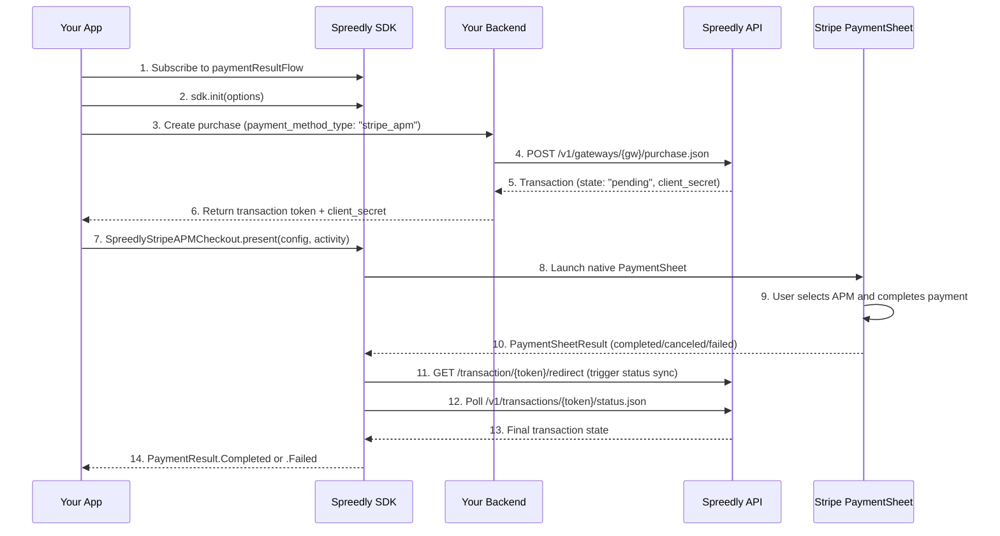

# Stripe APM Integration Guide

A practical guide for integrating Stripe Alternative Payment Methods (iDEAL, Bancontact, EPS, P24,
SEPA, etc.) into your Android app using the Spreedly SDK's `:stripe` module and the native Stripe
PaymentSheet.

## Table of Contents

- [Introduction](#introduction)
- [Stripe APM vs Other Payment Flows](#stripe-apm-vs-other-payment-flows)
- [Supported APM Types](#supported-apm-types)
- [Prerequisites](#prerequisites)
- [Project Setup](#project-setup)
- [How Stripe APM Works](#how-stripe-apm-works)
- [Backend Requirements](#backend-requirements)
- [Kotlin Integration](#kotlin-integration)
- [Java Integration](#java-integration)
- [Status Sync & Polling](#status-sync--polling)
- [PaymentResult Fields](#paymentresult-fields)
- [Error Handling](#error-handling)
- [Testing](#testing)
- [Troubleshooting](#troubleshooting)
- [API Reference](#api-reference)

---

## Introduction

### What is Stripe APM?

Stripe APM (Alternative Payment Methods) enables European and regional payment methods through the
native Stripe PaymentSheet. Instead of redirecting to a browser via Chrome Custom Tabs, the SDK
presents Stripe's native UI where customers select their preferred payment method and complete
checkout.

### Key Differences from Other Flows

- **No tokenization step** — the merchant backend creates a pending purchase directly on the
  Stripe Payment Intents gateway with `payment_method_type: "stripe_apm"`
- **Native UI** — uses Stripe's PaymentSheet instead of Chrome Custom Tabs
- **Separate module** — Stripe SDK dependencies are isolated in the `:stripe` module, keeping
  `payments-core` lightweight
- **Status sync** — after PaymentSheet completion, the SDK triggers Spreedly's redirect endpoint
  and polls for the final transaction state

---

## Stripe APM vs Other Payment Flows

| Feature                | Offsite (CCT)       | Stripe APM                       | Braintree APM                            |
|------------------------|---------------------|----------------------------------|------------------------------------------|
| **Tokenization**       | SDK tokenizes first | None (backend creates purchase)  | None (backend creates purchase)          |
| **Checkout UI**        | Chrome Custom Tab   | Stripe PaymentSheet              | Native PayPal/Venmo SDK                  |
| **Module**             | `payments-core`     | `:stripe` (separate)             | `:braintree` (separate)                  |
| **Maven Artifact**     | `checkout-payments-core` | `checkout-stripe-apm`       | `checkout-braintree-apm`                 |
| **SDK entry point**    | `SpreedlyOffsiteCheckout.present()` | `SpreedlyStripeAPMCheckout.present()` | `SpreedlyBraintreeAPMCheckout.present()` |
| **Configuration**      | `OffsitePaymentConfig` | `StripeAPMConfig`             | `BraintreeAPMCheckoutConfig`             |
| **Return handling**    | Deep link redirect  | Native (handled by PaymentSheet) | Native (handled by Braintree SDK)        |
| **Result delivery**    | `paymentResultFlow` | `paymentResultFlow`              | `paymentResultFlow`                      |
| **Status check**       | Single status check | Exponential backoff polling (~7s)| Single status check                      |
| **Flow stages**        | 4 (Idle → Tokenize → Purchase → Checkout) | 3 (Idle → Purchase → Checkout) | 3 (Idle → Purchase → Checkout) |

---

## Supported APM Types

| APM            | Stripe ID      | Currency | Region        |
|----------------|----------------|----------|---------------|
| iDEAL          | `ideal`        | EUR      | Netherlands   |
| Bancontact     | `bancontact`   | EUR      | Belgium       |
| EPS            | `eps`          | EUR      | Austria       |
| Przelewy24     | `p24`          | PLN/EUR  | Poland        |
| SEPA Debit     | `sepa_debit`   | EUR      | Eurozone      |

Additional APMs can be enabled by passing their Stripe identifier in the `apm_types` array when
creating the purchase on your backend. The Stripe PaymentSheet dynamically displays the APMs that
are available for the given currency, country, and Stripe account configuration.

---

## Prerequisites

### Minimum Requirements

See the [Compatibility table](../../README.md#compatibility) in the README for current version requirements (Android API level, Kotlin, Gradle, JDK).

### Stripe Account

- A **Stripe Payment Intents** gateway configured in your Spreedly environment (not a regular Stripe
  gateway)
- A **Stripe publishable key** (`pk_test_...` or `pk_live_...`)
- The desired APMs enabled in your Stripe Dashboard

### Spreedly Environment

1. Log in to [Spreedly](https://core.spreedly.com)
2. Add a Stripe Payment Intents gateway
3. Obtain your environment key and gateway token

---

## Project Setup

### Step 1: Configure the Maven Repository

The Spreedly SDK is hosted on GitHub Packages. If you haven't already, add the repository to your
`settings.gradle.kts` as described in [Getting Started — Install](getting-started.md#1-install).

### Step 2: Add Dependencies

Add the `:stripe` module to your app's `build.gradle.kts`:

```kotlin
dependencies {
    implementation("com.spreedly:checkout-stripe-apm:$spreedlyVersion")
}
```

The `:stripe` module transitively includes `payments-core` and bundles the Stripe Android SDK — no
additional Stripe dependency is needed in your app module.

### Step 3: Configure Build Properties

Add your Stripe keys to `apikeys.properties`:

```properties
stripeGatewayToken=your_stripe_payment_intents_gateway_token
stripePublishableKey=pk_test_your_stripe_publishable_key
```

Expose them as `BuildConfig` fields in your app's `build.gradle.kts`:

```kotlin
buildConfigField("String", "STRIPE_GATEWAY_TOKEN", "\"${stripeGatewayToken}\"")
buildConfigField("String", "STRIPE_PUBLISHABLE_KEY", "\"${stripePublishableKey}\"")
```

---

## How Stripe APM Works



**Key difference from standard offsite:** Steps 3–6 replace the tokenize-then-purchase pattern. The
backend creates the purchase in one call with the payment method type embedded in the request body,
and Stripe returns a `client_secret` that the SDK uses to present the PaymentSheet.

---

## Backend Requirements

### Purchase API

Your backend creates a purchase with `payment_method_type: "stripe_apm"` — there is no tokenization
step. Use `SpreedlyOffsiteCheckout.redirectUrl(context, "stripe/checkout")` for the `redirect_url`
so the SDK-owned `OffsiteReturnActivity` receives the redirect:

```kotlin
val redirectUrl = SpreedlyOffsiteCheckout.redirectUrl(context, "stripe/checkout")
// e.g. "com.your-app.spreedlyoffsite://stripe/checkout"
```

```json
POST https://core.spreedly.com/v1/gateways/{stripe_gateway_token}/purchase.json

{
    "transaction": {
        "amount": 4400,
        "currency_code": "EUR",
        "channel": "app",
        "redirect_url": "{applicationId}.spreedlyoffsite://stripe/checkout",
        "callback_url": "https://your-backend.com/webhooks/stripe",
        "payment_method": {
            "payment_method_type": "stripe_apm",
            "apm_types": ["ideal", "bancontact", "eps", "p24", "sepa_debit"]
        }
    }
}
```

**Response from Spreedly (pending state):**

```json
{
    "transaction": {
        "token": "trans_abc123",
        "state": "pending",
        "succeeded": false,
        "gateway_specific_response_fields": {
            "stripe_payment_intents": {
                "client_secret": "pi_xxx_secret_yyy"
            }
        }
    }
}
```

Your backend returns the `token` and `client_secret` to the app to build the `StripeAPMConfig`.

### Authentication Parameters API

Same as other Spreedly flows — your backend provides single-use auth params per payment attempt.
See [Offsite Payment Integration Guide — SDK Initialization](offsite-payments.md#sdk-initialization).

---

## Kotlin Integration

### Step 1: Subscribe to Payment Results (BEFORE Payment)

Set up result collection before initiating payment. This follows the same pattern as
[Offsite Payments — Step 1](offsite-payments.md#step-1-subscribe-to-payment-results-before-payment):

```kotlin
init {
    observePaymentResults()
}

private var resultObserverJob: Job? = null

private fun observePaymentResults() {
    resultObserverJob?.cancel()
    resultObserverJob = viewModelScope.launch {
        sdk.paymentResultFlow.collect { result ->
            when (result) {
                is PaymentResult.Completed -> {
                    val message = when (result.state) {
                        "succeeded" -> "Payment successful!"
                        "pending" -> "Payment submitted! Awaiting confirmation..."
                        else -> "Payment completed. State: ${result.state}"
                    }
                    handleSuccess(message)
                }
                is PaymentResult.Failed -> {
                    handleFailure(result.message ?: "Payment failed")
                }
                is PaymentResult.Canceled -> {
                    handleCancellation()
                }
                PaymentResult.Initial -> {}
            }
        }
    }
}
```

### Step 2: Create Pending Purchase on Your Backend

```kotlin
val response = purchaseClient.stripeAPMPurchase(
    amount = 4400,
    currencyCode = "EUR",
    apmTypes = listOf("ideal", "bancontact", "eps", "p24", "sepa_debit"),
)

val transaction = response.transaction
    ?: throw Exception("No transaction in response")

if (transaction.state != "pending") {
    throw Exception("Expected pending state, got: ${transaction.state}")
}

val clientSecret = transaction.gatewaySpecificResponseFields
    ?.stripePaymentIntents?.clientSecret
    ?: throw Exception("Missing client_secret in response")
```

### Step 3: Build StripeAPMConfig and Present PaymentSheet

```kotlin
import com.spreedly.stripe.StripeAPMConfig
import com.spreedly.stripe.StripeAPMAppearanceConfig
import com.spreedly.stripe.SpreedlyStripeAPMCheckout

val config = StripeAPMConfig(
    publishableKey = "pk_test_...",
    clientSecret = clientSecret,
    transactionToken = transaction.token,
    merchantDisplayName = "Your Store Name",
)

SpreedlyStripeAPMCheckout.present(config, activity)
```

Optional **PaymentSheet appearance** (colors, shapes, typography, primary button) maps to Stripe
`PaymentSheet.Appearance` via [StripeAPMAppearanceConfig](../../stripe/src/main/java/com/spreedly/stripe/StripeAPMAppearanceConfig.kt).
Field support is documented in [STRIPE_22_8_APPEARANCE_FIELD_MATRIX](../development/STRIPE_22_8_APPEARANCE_FIELD_MATRIX.md).

```kotlin
val appearance = StripeAPMAppearanceConfig(
    shapes = StripeAPMAppearanceConfig.Shapes(cornerRadiusDp = 12f, borderStrokeWidthDp = 1f),
    colors = StripeAPMAppearanceConfig.Colors(primary = 0xFF6750A4.toInt()),
    typography = StripeAPMAppearanceConfig.Typography(fontSizeScaleFactor = 1.05, fontFamilyResId = null),
)
SpreedlyStripeAPMCheckout.present(config, activity, appearance)
```

The SDK will:

1. Validate the config (fail fast if any required field is blank)
2. Launch a transparent `StripeAPMActivity` that hosts the PaymentSheet
3. Present the native Stripe PaymentSheet with the configured APMs
4. When the user completes: trigger Spreedly's redirect endpoint to sync status, then poll
5. When the user cancels/fails: publish the result immediately
6. Publish the final result through `paymentResultFlow`

### Step 4: Handle the Result

Results arrive via `paymentResultFlow` (set up in Step 1). The Stripe PaymentSheet handles all
redirects internally — **no `OffsiteReturnActivity` or deep link handling is needed**.

### Complete Kotlin Example

```kotlin
class StripeAPMPaymentViewModel(
    private val context: Context,
    private val activity: Activity,
) : ViewModel() {

    private val sdk = Spreedly()
    private val purchaseClient = SpreedlyPurchaseAPIClient()
    private val _errorMessage = MutableStateFlow<String?>(null)
    val errorMessage: StateFlow<String?> = _errorMessage.asStateFlow()

    private suspend fun initializeSDKWithFreshAuth() {
        if (sdk.isInitialized) return
        val authParams = yourAuthService.getAuthParams()
        val options = SpreedlySDKInitOptions(
            nonce = authParams.nonce,
            signature = authParams.signature,
            certificateToken = authParams.certificateToken,
            timestamp = authParams.timestamp.toString(),
            environmentKey = "your_environment_key",
            context = context.applicationContext,
        )
        sdk.init(options)
    }

    fun startStripeAPMPayment(amountCents: Int) {
        viewModelScope.launch {
            try {
                initializeSDKWithFreshAuth()

                val response = purchaseClient.stripeAPMPurchase(
                    amount = amountCents,
                    currencyCode = "EUR",
                    apmTypes = listOf("ideal", "bancontact", "eps", "p24", "sepa_debit"),
                )

                val transaction = response.transaction
                    ?: throw Exception("No transaction in response")

                val clientSecret = transaction.gatewaySpecificResponseFields
                    ?.stripePaymentIntents?.clientSecret
                    ?: throw Exception("Missing client_secret")

                val config = StripeAPMConfig(
                    publishableKey = BuildConfig.STRIPE_PUBLISHABLE_KEY,
                    clientSecret = clientSecret,
                    transactionToken = transaction.token,
                    merchantDisplayName = "Example Store",
                )

                SpreedlyStripeAPMCheckout.present(config, activity, appearance)

            } catch (e: Exception) {
                _errorMessage.value = e.message
            }
        }
    }
}
```

---

## Java Integration

The `:stripe` module provides `StripeAPMJavaHelper` with `@JvmStatic` methods and
`Consumer`/`Runnable` callbacks for Java consumers:

```java
import com.spreedly.stripe.StripeAPMJavaHelper;
import com.spreedly.stripe.StripeAPMConfig;

// Start monitoring before presenting checkout
StripeAPMJavaHelper.startPaymentResultMonitoring(
    this, // LifecycleOwner
    sdk,
    result -> {
        Log.d("Payment", "Completed: " + result.getState());
    },
    result -> {
        Log.e("Payment", "Failed: " + result.getDescription());
    },
    () -> {
        Log.d("Payment", "Canceled by user");
    }
);

// Present the Stripe PaymentSheet (optional third argument: StripeAPMAppearanceConfig)
StripeAPMJavaHelper.presentCheckout(config, this);
// Or with appearance:
// StripeAPMJavaHelper.presentCheckout(config, this, appearance);

// Check status
boolean active = StripeAPMJavaHelper.isCheckoutActive();
boolean ready = StripeAPMJavaHelper.isInitialized(sdk);
```

**Java Notes:**

- `StripeAPMJavaHelper` lives in the `:stripe` module (`com.spreedly.stripe`)
- All methods are `@JvmStatic` — call directly on the class
- Uses `Consumer<PaymentResult.Completed>`, `Consumer<PaymentResult.Failed>`, and `Runnable` for
  callbacks
- See
  [`StripeAPMJavaHelper.kt`](../../stripe/src/main/java/com/spreedly/stripe/StripeAPMJavaHelper.kt)
  for the full implementation

---

## Status Sync & Polling

After the Stripe PaymentSheet completes, the SDK triggers Spreedly's transaction redirect endpoint
(`GET /transaction/{token}/redirect`) to sync the transaction status with the gateway. In web/iframe
flows this redirect happens naturally via the browser; for native PaymentSheet flows the SDK
triggers it programmatically.

After the redirect trigger, the SDK polls with exponential backoff:

| Attempt | Delay           | Cumulative Wait |
|---------|-----------------|-----------------|
| 1       | 0ms (immediate) | 0ms             |
| 2       | 1,000ms         | 1s              |
| 3       | 2,000ms         | 3s              |
| 4       | 4,000ms         | 7s              |

If the transaction is still `pending` after all retries, the SDK returns `PaymentResult.Completed`
with `state = "pending"` — treat this as a soft success and confirm via your backend webhook.

---

## PaymentResult Fields

### PaymentResult.Completed

| Field                   | Type                        | Description                                       |
|-------------------------|-----------------------------|---------------------------------------------------|
| `token`                 | `String`                    | Spreedly transaction token                        |
| `state`                 | `String?`                   | Transaction state: `"succeeded"`, `"processing"`, `"pending"`, etc. |
| `paymentMethodResponse` | `PaymentMethodResponse?`    | Always `null` for Stripe APM                      |

### PaymentResult.Failed

| Field           | Type         | Description                                       |
|-----------------|--------------|---------------------------------------------------|
| `errorType`     | `ErrorType`  | Error category                                    |
| `message`       | `String?`    | Human-readable error message                      |
| `state`         | `String?`    | Transaction state at time of failure              |

### PaymentResult.Canceled

Emitted when the user dismisses the Stripe PaymentSheet without completing payment. Use
`paymentResultFlow` / `PaymentResult.Canceled` to detect user dismissals. `ApmCheckoutCompleted`
telemetry records `success = false` for cancel as well, so do not infer cancel from telemetry
alone.

---

## Error Handling

### Config Validation Errors

`SpreedlyStripeAPMCheckout.present()` validates the config before launching. If any required field
is blank, it publishes `PaymentResult.Failed` immediately:

```kotlin
is PaymentResult.Failed -> {
    when {
        result.message?.contains("publishable key") == true -> {
            // Missing or blank Stripe publishable key
        }
        result.message?.contains("Client secret") == true -> {
            // Missing or blank client secret
        }
        result.message?.contains("Transaction token") == true -> {
            // Missing or blank transaction token
        }
    }
}
```

### PaymentSheet Errors

Errors from the Stripe PaymentSheet itself (network issues, card declines, etc.) are surfaced
through `PaymentResult.Failed` with the Stripe error message.

---

## Testing

### Test Configuration

Use Stripe test mode keys (`pk_test_...`) and Spreedly's test environment:

```kotlin
val config = StripeAPMConfig(
    publishableKey = "pk_test_...",
    clientSecret = clientSecret,       // From test purchase response
    transactionToken = transactionToken,
    merchantDisplayName = "Test Store",
)
```

### Testing Flow

1. Create a pending purchase via your backend (test mode)
2. Present the PaymentSheet with the test `client_secret`
3. Select an APM (e.g., iDEAL) in the PaymentSheet
4. Complete the test payment flow
5. Verify the `PaymentResult` received via `paymentResultFlow`

### Debug Logging

```bash
adb logcat | grep -E "(Spreedly|StripeAPM|SpreedlyStripeAPMCheckout)"
```

---

## Troubleshooting

### Issue: PaymentSheet Not Appearing

**Symptom:** Nothing happens or the app crashes after calling `SpreedlyStripeAPMCheckout.present()`

**Solutions:**

1. Verify `StripeAPMConfig` has all required fields populated (non-blank):
   ```kotlin
   StripeAPMConfig(
       publishableKey = "pk_test_...",      // Must be non-blank
       clientSecret = "pi_xxx_secret_yyy",  // Must be non-blank
       transactionToken = "trans_abc123",    // Must be non-blank
       merchantDisplayName = "My Store",     // Must be non-blank
   )
   ```
2. Ensure the Stripe publishable key matches the key used to create the PaymentIntent on the backend
3. Check that the purchase response has `state: "pending"` — a non-pending state means the
   PaymentIntent was not created correctly
4. Verify `client_secret` is present in `gateway_specific_response_fields.stripe_payment_intents`

### Issue: Payment Stays "pending" or "processing" After Completion

**Symptom:** PaymentSheet completes but the result shows `state = "pending"` or `state = "processing"`

**Cause:** In native mobile flows, the browser redirect through Spreedly's server (which updates the
transaction status) doesn't happen naturally. For SEPA Direct Debit, the bank debit is asynchronous
and the transaction may remain in `"processing"` until the bank confirms. The SDK mitigates this by
programmatically triggering Spreedly's redirect endpoint and polling up to 4 times (~7 seconds total).

**Solution:** Treat `pending` and `processing` as soft success and confirm via your backend webhook:

```kotlin
is PaymentResult.Completed -> {
    when (result.state) {
        "succeeded" -> showSuccess("Payment successful!")
        "processing" -> showSuccess("Payment accepted and is being processed. Final confirmation may take a few days.")
        "pending" -> showSuccess("Payment submitted! Awaiting confirmation...")
        else -> showInfo("Payment state: ${result.state}")
    }
}
```

### Issue: "Missing client_secret" Error

**Symptom:** `"Missing client_secret in response"` after calling your purchase API

**Solutions:**

1. Ensure your Spreedly gateway is a **Stripe Payment Intents** gateway (not a regular Stripe
   gateway)
2. Verify the purchase request includes `payment_method.payment_method_type: "stripe_apm"` and
   `payment_method.apm_types`
3. Check that the transaction `state` is `"pending"` — only pending transactions include
   `client_secret`
4. Confirm the response JSON includes
   `gateway_specific_response_fields.stripe_payment_intents.client_secret`

### Issue: "Invalid publishable key"

**Symptom:** Stripe SDK throws an error about invalid configuration

**Solutions:**

1. The publishable key must start with `pk_test_` (test) or `pk_live_` (production)
2. Ensure the key matches the Stripe account linked to your Spreedly Stripe Payment Intents gateway
3. Check that `apikeys.properties` has the correct `stripePublishableKey` value

### Getting Help

For general error handling patterns, see [Error Handling](error-handling.md).

1. **Check logs** — Use `adb logcat | grep Spreedly` for SDK activity
2. **Review sample app** — See
   [`StripeAPMPaymentViewModel.kt`](../../app/src/main/java/com/spreedly/example/screens/stripeapmpayment/StripeAPMPaymentViewModel.kt)
   (Kotlin) and
   [`StripeAPMJavaHelper.kt`](../../stripe/src/main/java/com/spreedly/stripe/StripeAPMJavaHelper.kt)
   (Java)
3. **Contact support** — Reach out to Spreedly support with logs and error messages

---

## API Reference

### SpreedlyStripeAPMCheckout

Singleton (`object`) for presenting Stripe APM checkout via the native Stripe PaymentSheet.

**Package:** `com.spreedly.stripe`

#### `present(config: StripeAPMConfig, activity: Activity, appearance: StripeAPMAppearanceConfig? = null)`

Launch the Stripe PaymentSheet for APM checkout. Validates the config, launches a transparent
`StripeAPMActivity`, and presents the PaymentSheet.

**Parameters:**

- `config` — The Stripe APM configuration built from the purchase response
- `activity` — The Activity context to launch from
- `appearance` — Optional styling mapped to Stripe `PaymentSheet.Appearance` (omit for defaults)

```kotlin
SpreedlyStripeAPMCheckout.present(config, activity)
SpreedlyStripeAPMCheckout.present(config, activity, appearance)
```

If a checkout is already active, the SDK logs a warning and still starts the new session.

---

#### `finalizeIfActive()`

No-op for Stripe APM (the dedicated Activity handles lifecycle). Kept for API consistency with
`SpreedlyOffsiteCheckout`.

---

#### `isActive(): Boolean`

Check if a Stripe APM checkout is currently in progress.

---

#### `callerActivityClassName(): String?`

Get the class name of the activity that initiated the checkout.

---

### StripeAPMConfig

Configuration for presenting Stripe APM checkout via the PaymentSheet.

**Package:** `com.spreedly.stripe`

```kotlin
data class StripeAPMConfig(
    val publishableKey: String,
    val clientSecret: String,
    val transactionToken: String,
    val merchantDisplayName: String,
    val returnURL: String? = null,
)
```

| Property              | Type      | Required | Description                                                    |
|-----------------------|-----------|----------|----------------------------------------------------------------|
| `publishableKey`      | `String`  | Yes      | Stripe publishable key (`pk_test_...` or `pk_live_...`)        |
| `clientSecret`        | `String`  | Yes      | PaymentIntent client secret from purchase response             |
| `transactionToken`    | `String`  | Yes      | Spreedly transaction token from purchase response              |
| `merchantDisplayName` | `String`  | Yes      | Display name shown in PaymentSheet                             |
| `returnURL`           | `String?` | No       | Reference only — not used by SDK                               |

All fields except `returnURL` must be non-blank. The SDK validates before launching the PaymentSheet
and publishes `PaymentResult.Failed` if validation fails.

---

### StripeAPMJavaHelper

Java interop helper with `@JvmStatic` methods.

**Package:** `com.spreedly.stripe`

#### `startPaymentResultMonitoring(...)`

```kotlin
@JvmStatic
fun startPaymentResultMonitoring(
    lifecycleOwner: LifecycleOwner,
    sdk: Spreedly,
    onCompleted: Consumer<PaymentResult.Completed>,
    onFailed: Consumer<PaymentResult.Failed>,
    onCanceled: Runnable,
)
```

#### `presentCheckout(config: StripeAPMConfig, activity: Activity, appearance: StripeAPMAppearanceConfig? = null)`

```kotlin
@JvmStatic
@JvmOverloads
fun presentCheckout(
    config: StripeAPMConfig,
    activity: Activity,
    appearance: StripeAPMAppearanceConfig? = null,
)
```

#### `isCheckoutActive(): Boolean`

```kotlin
@JvmStatic
fun isCheckoutActive(): Boolean
```

#### `isInitialized(sdk: Spreedly): Boolean`

```kotlin
@JvmStatic
fun isInitialized(sdk: Spreedly): Boolean
```

#### `createConfig(...): StripeAPMConfig`

Java-friendly factory method to build a `StripeAPMConfig` without Kotlin default parameters:

```kotlin
@JvmStatic
fun createConfig(
    publishableKey: String,
    clientSecret: String,
    transactionToken: String,
    merchantDisplayName: String,
    returnURL: String?,
): StripeAPMConfig
```

#### `currentTransactionToken(): String?`

Get the current transaction token if a checkout is active:

```kotlin
@JvmStatic
fun currentTransactionToken(): String?
```

---

## Additional Resources

- [Offsite Payment Integration Guide](offsite-payments.md) — Standard offsite
  payments (Chrome Custom Tabs, EBANX)
- [Braintree APM Integration Guide](braintree-apm.md) — PayPal/Venmo via
  Braintree
- [Stripe Payment Methods Documentation](https://stripe.com/docs/payments/payment-methods)
- [Stripe PaymentSheet Android SDK](https://stripe.com/docs/payments/accept-a-payment?platform=android)
