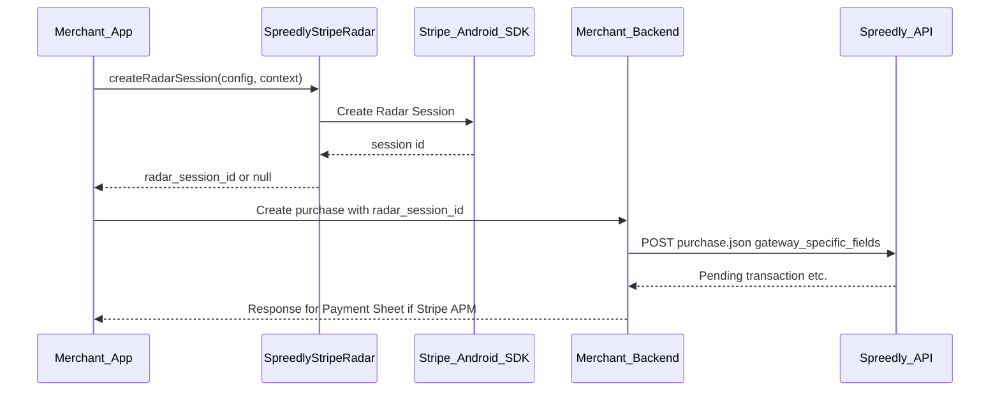

# Stripe Radar Integration Guide

A practical guide for collecting Stripe Radar device data on Android using the Spreedly SDK's
`checkout-stripe-radar` module. The SDK creates a Radar session and returns a session ID for your
backend to attach to Spreedly purchase or authorization requests.

## Table of Contents

- [Introduction](#introduction)
- [Stripe Radar vs Other SDK Features](#stripe-radar-vs-other-sdk-features)
- [Prerequisites](#prerequisites)
- [Project Setup](#project-setup)
- [How Stripe Radar Works](#how-stripe-radar-works)
- [Backend Requirements](#backend-requirements)
- [Kotlin Integration](#kotlin-integration)
- [Java Integration](#java-integration)
- [Stripe Connect (Optional)](#stripe-connect-optional)
- [Error Handling](#error-handling)
- [Testing](#testing)
- [Troubleshooting](#troubleshooting)
- [API Reference](#api-reference)
- [Additional Resources](#additional-resources)

---

## Introduction

### What is Stripe Radar in this SDK?

Stripe Radar uses device signals to help detect fraud. The `:stripe-radar` module exposes
**Radar Session creation only**: your app obtains a `radar_session_id` from Stripe via the Stripe
Android SDK, then passes that ID to Spreedly on the **next** API call (typically the Stripe Payment
Intents purchase your backend creates for Stripe APM).

### Key Points

- **Not a checkout flow** — no Payment Sheet, no `paymentResultFlow` emission from Radar alone.
- **Pre-payment helper** — call before or while preparing the purchase; send the session ID with the purchase body.
- **Separate artifact** — `checkout-stripe-radar`; keeps Stripe Radar dependency isolated from apps that do not need it.
- **Coexists with Stripe APM** — uses an explicit `Stripe` instance per call and does **not** set Stripe's global `PaymentConfiguration`, so it pairs cleanly with `:stripe` (PaymentSheet).

---

## Stripe Radar vs Other SDK Features

| Feature | Stripe Radar (this guide) | Stripe APM | Braintree APM |
|---------|---------------------------|------------|---------------|
| **Purpose** | Device fingerprint / Radar session ID | Present Payment Sheet for iDEAL, Bancontact, etc. | PayPal / Venmo native checkout |
| **Primary output** | `radar_session_id` (string or null) | Pending transaction + `client_secret` | Nonce + `device_data` (confirm flow) |
| **Maven artifact** | `checkout-stripe-radar` | `checkout-stripe-apm` | `checkout-braintree-apm` |
| **Typical timing** | Before backend creates Stripe PI purchase | After backend returns pending purchase | After backend returns pending purchase |
| **Gateway-specific field** | `stripe_payment_intents.radar_session_id` | (none from Radar) | Braintree-specific blocks |

Radar complements Stripe APM: collect a session ID early, include it in the same pending purchase request your backend sends for Payment Sheet flows.

---

## Prerequisites

1. **Spreedly SDK** installed and initialized per [Getting Started](getting-started.md).
2. **Stripe publishable key** (`pk_test_...` or `pk_live_...`) aligned with your Stripe Payment Intents gateway in Spreedly.
3. **Radar Session** enabled for your Stripe account (Stripe Dashboard / Radar settings — confirm with Stripe docs for your account type).
4. **Minimum toolchain** — See the [Compatibility table](../../README.md#compatibility) in the root README.

---

## Project Setup

### Maven Repository

If not already configured, add GitHub Packages as described in [Getting Started — Install](getting-started.md#1-install).

### Gradle Dependency

Add the Radar module alongside modules you already use (for example Stripe APM):

```kotlin
dependencies {
    implementation("com.spreedly:checkout-stripe-radar:$spreedlyVersion")
    // Often paired with Stripe APM:
    // implementation("com.spreedly:checkout-stripe-apm:$spreedlyVersion")
}
```

The `:stripe-radar` module depends on `payments-core` as `api` and bundles the Stripe Android SDK for Radar Session APIs — you do not add a separate `com.stripe:stripe-android` line for Radar alone.

### Keys

Keep publishable keys out of source control. The demo app uses `BuildConfig` fields wired from `apikeys.properties`; mirror that pattern in your app.

---

## How Stripe Radar Works



---

## Backend Requirements

Your backend should accept an optional Radar session ID from the app and send it on the Spreedly
purchase (or authorization) under **`gateway_specific_fields.stripe_payment_intents.radar_session_id`**.

Example shape (aligned with the demo app's Kotlin models in `SpreedlyPurchaseModels.kt`):

```json
{
  "transaction": {
    "amount": 4400,
    "currency_code": "EUR",
    "channel": "app",
    "redirect_url": "your-app-scheme://stripe/checkout",
    "callback_url": "https://your-backend.example/webhooks/spreedly",
    "payment_method": {
      "payment_method_type": "stripe_apm",
      "apm_types": ["ideal", "bancontact"]
    },
    "gateway_specific_fields": {
      "stripe_payment_intents": {
        "radar_session_id": "rse_xxxxxxxxxxxxx"
      }
    }
  }
}
```

Omit `gateway_specific_fields` entirely when you do not have a session ID (optional Radar).

For general Stripe APM purchase fields and redirects, see [Stripe APM — Backend Requirements](stripe-apm.md#backend-requirements).

---

## Kotlin Integration

### Step 1: Build Configuration

```kotlin
import com.spreedly.striperadar.StripeRadarConfig

val config = StripeRadarConfig(
    publishableKey = publishableKey,
    // stripeAccount = "acct_xxx", // optional — Stripe Connect
)
```

### Step 2: Collect Session (suspend)

Use any coroutine scope appropriate for your layer (`viewModelScope`, `lifecycleScope`, etc.):

```kotlin
import com.spreedly.striperadar.SpreedlyStripeRadar

val sessionId: String? = SpreedlyStripeRadar.createRadarSession(config, context)
```

### Step 3: Send Session ID to Your Backend

Pass `sessionId` into the API that creates the Spreedly transaction so your server can include
`gateway_specific_fields.stripe_payment_intents.radar_session_id` when present.

### Demo App Reference

The sample Stripe APM screen collects Radar when the user opts in, stores the ID in state, and passes it into the purchase client:

- [`StripeAPMPaymentViewModel.kt`](../../app/src/main/java/com/spreedly/example/screens/stripeapmpayment/StripeAPMPaymentViewModel.kt) — `toggleRadar`, `collectRadarSession`, `radarSessionId` passed to `stripeAPMPurchase(...)`.
- [`SpreedlyPurchaseAPIClient.kt`](../../app/src/main/java/com/spreedly/example/api/SpreedlyPurchaseAPIClient.kt) — maps `radarSessionId` into `StripeGatewaySpecificFields`.

---

## Java Integration

Use the callback overload; it invokes the callback on the **main** thread and returns a **Kotlin**
`Job` you can cancel.

```java
import com.spreedly.striperadar.SpreedlyStripeRadar;
import com.spreedly.striperadar.StripeRadarConfig;
import kotlin.Unit;
import kotlinx.coroutines.Job;

StripeRadarConfig config = new StripeRadarConfig(publishableKey, null);

Job job = SpreedlyStripeRadar.INSTANCE.createRadarSession(
    config,
    context,
    radarSessionId -> {
        if (radarSessionId != null) {
            // Send radarSessionId to your backend
        }
        return Unit.INSTANCE;
    }
);
```

---

## Stripe Connect (Optional)

If you collect on behalf of a connected account, pass the Stripe Connect account ID:

```kotlin
StripeRadarConfig(
    publishableKey = publishableKey,
    stripeAccount = "acct_xxxxxxxxxxxxx",
)
```

---

## Error Handling

- **`createRadarSession` returns `null` on failure** — it does not throw for Stripe/SDK failures; failures still emit a Spreedly analytics event (`device_data_collected` with `success = false` and an `error_type` when available).
- **Degraded path** — If Radar is optional for your risk policy, omit `gateway_specific_fields` when `sessionId` is null and proceed with the purchase.
- **Never block checkout indefinitely** — collect Radar before showing pay UI or with a timeout policy your product team agrees on.

---

## Testing

1. Use **`pk_test_...`** and your Spreedly test environment.
2. Confirm Radar Session creation returns a non-null ID on a supported device/emulator.
3. Verify your backend receives the ID and Spreedly accepts the purchase payload (inspect transaction JSON for `gateway_specific_fields.stripe_payment_intents.radar_session_id`).

---

## Troubleshooting

| Symptom | Likely cause | What to check |
|---------|----------------|---------------|
| Always `null` session ID | Invalid or blank publishable key | Key matches Stripe account for the gateway; non-empty string |
| Always `null` session ID | Radar Session not enabled | Stripe Dashboard / account capabilities |
| Purchase rejected after adding field | Wrong nesting or key name | Must be `gateway_specific_fields.stripe_payment_intents.radar_session_id` |
| Works on Stripe APM without Radar | N/A | Radar is optional; omit block when no session |

---

## API Reference

### `SpreedlyStripeRadar`

**Package:** `com.spreedly.striperadar`

| API | Description |
|-----|-------------|
| `suspend fun createRadarSession(config: StripeRadarConfig, context: Context): String?` | Suspending Radar Session creation; returns session ID or `null`. |
| `fun createRadarSession(config: StripeRadarConfig, context: Context, callback: (String?) -> Unit): Job` | Same behavior; callback always runs on the main thread; returns cancellable `Job`. |

#### Nested Objects

| Object | Constant | Value |
|--------|----------|-------|
| `Keys` | `RADAR_SESSION_ID` | `"radar_session_id"` — JSON field name for gateway-specific maps |
| `Analytics` | `PROVIDER` | `"stripe_radar"` — telemetry provider tag |

### `StripeRadarConfig`

```kotlin
data class StripeRadarConfig(
    val publishableKey: String,
    val stripeAccount: String? = null,
)
```

| Property | Required | Description |
|----------|----------|-------------|
| `publishableKey` | Yes | Stripe publishable key (`pk_test_...` / `pk_live_...`). |
| `stripeAccount` | No | Stripe Connect account ID when collecting on behalf of a connected account. |

---

## Additional Resources

- [Stripe APM Integration Guide](stripe-apm.md) — Pending purchase + Payment Sheet flow where Radar session IDs are commonly attached.
- [Getting Started](getting-started.md) — Install and SDK initialization.
- [Stripe Radar Session documentation](https://stripe.com/docs/radar/radar-session) — Product behavior on the Stripe side (confirm latest Stripe docs for your integration).
